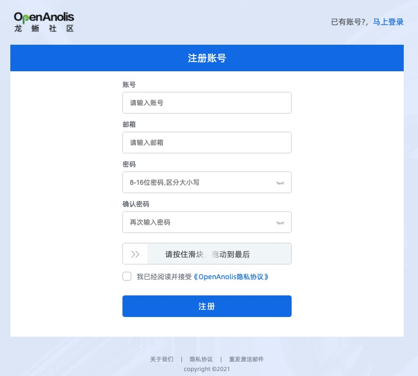
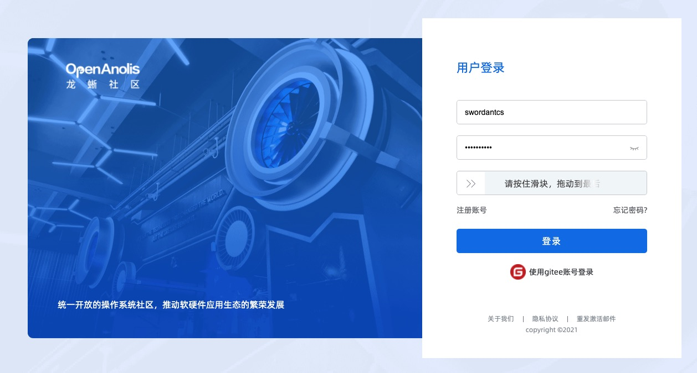
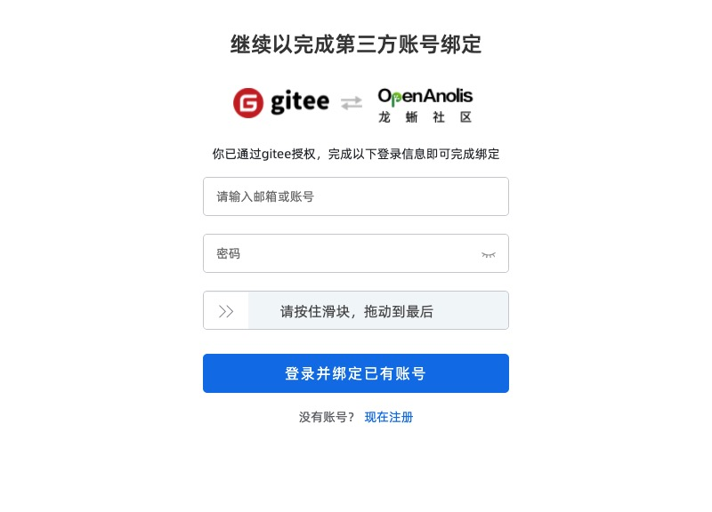
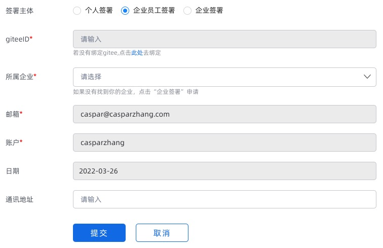

# 101 - 社区账号指南

龙蜥社区涉及的账号体系主要有两处。一处是官网账号系统，另一处是 Gitee 账号。

## 1. 账号作用范围

简单来讲，在社区**涉及代码操作的部分**，使用 Gitee 账号；其余所有系统，都使用 OpenAnolis 龙蜥社区账号。龙蜥社区账号支持下列常见的功能板块和基础设施：
+ [邮件列表系统](https://lists.openanolis.cn/)；
+ [SIG 系统](https://openanolis.cn/sig)；
+ [活动报名](https://openanolis.cn/activity)；
+ [Bug跟踪系统](https://bugzilla.openanolis.cn/)；
+ [测试平台](https://testfarm.openanolis.cn/)；
+ [龙蜥实验室](https://lab.openanolis.cn/)
更多功能和基础设施正在添加中，如果想要一睹为快，请记得先注册一个社区账号吧！

## 2. 注册社区账号

在龙蜥社区[官网主站](https://openanolis.cn/)右上角有注册入口。在主站的绝大部分系统中，都可以随时随地注册和登录。或者直接点击[账号注册](https://passport.openanolis.cn/register)页面。

**注**：如果你是企业用户，建议使用公司邮箱注册，在 Bugzilla 和其他一些开发者基础设施中，可能会对开发者所属企业进行分组，使用公司邮箱后缀注册可以提高分组的准确性。

注册完毕后，邮箱会收到一封激活邮件，点击邮件中的链接确认激活后，即可完成注册流程。

## 3. 登录社区账号

完成注册后，在龙蜥社区[官网主站](https://openanolis.cn/)右上角，或直接访问[账号登录](https://passport.openanolis.cn/login/)页面，即可登录社区账号。

注意社区还提供了通过 Gitee 账号来登录的功能，该功能仍然**要求提前注册社区账号**，只是在完成账号绑定后，可以直接通过 Gitee 账号来登录社区主站。点击上图中的“使用 gitee 账号登录”链接，跳转到下图：

完成绑定后，即可通过 Gitee 账号登录社区主站。

## 4. 注册 Gitee 账号

可以点击 [Gitee 注册链接](https://gitee.com/signup)注册 Gitee 账号，也可以参考 [Gitee 帮助中心](https://gitee.com/help/categories/19) 页面获取更多的帮助。

*注*: 我们强烈建议 Gitee 账号贡献代码时的代码提交邮箱和社区注册邮箱保持一致，可以在 [Gitee 邮箱配置](https://gitee.com/profile/emails) 界面添加多个邮箱，并设置提交邮箱和社区注册邮箱一致。

## 5. 完成账号注册后推荐的动作

### 5.1 完成 CLA (贡献者许可协议) 的签署

在开发者向社区提交代码时，会被要求签署“[贡献者许可协议 (CLA)](https://openanolis.cn/pact/contributor)”，签署前需要保证 Gitee 账号已经注册并绑定。我们强烈建议 Gitee 账号的提交邮箱和社区注册邮箱一致，以确保提交代码时 CLA 协议的有效性。

根据不同的开发者类型，签署方式也有细微差别：
+ 如果是个人开发者，直接点击“个人签署”并确保相关内容准确即可提交；
+ 如果是企业开发者，且所属企业已经与龙蜥社区完成企业层面的签署，则可在_所属企业_下拉菜单中选中自己的企业，确认其他内容无误后提交企业管理员审核，审核通过后即完成签署；
+ 如果是企业管理员，尚未完成企业层面的签署，请联系龙蜥社区运营代表，按流程完成签署。

### 5.2 在 Gitee 中添加 ssh 公钥

在拉取 Gitee 仓库代码时，首选推荐方式为通过 ssh 公钥拉取，以获得更好的稳定性。配置 ssh 公钥的地址在[这里](https://gitee.com/profile/sshkeys)。
