# 104 - 测试龙蜥操作系统

怎样测试龙蜥操作系统 (Anolis OS) 的性能和功能？有的同学或许使用过 ltp，unixbench，sysbench 等常见的测试工具，有的同学可能没有接触过。使用这些测试工具来评估操作系统的性能和功能，需要了解它的使用方式，包括编译安装，执行测试，数据收集等等，有时候还需要重复执行多次，对于绝大多数人来说整个过程还是较为繁琐，你可能会想如果有个用鼠标点击几次就可以发起测试任务，并且自动收集测试结果的工具就好了。这个时候 [T-One](https://tone.openanolis.cn/)（testing in one） 就能完美解决这个需求，它还能提供一站式自动化测试集成、管理、执行、分析，以及提高跨团队、跨企业质量协作能力。 下面介绍一下如何用 T-one 平台发起一个简单的测试任务。

## 1. 发起任务

### 1.1 进入workspace

首先选择测试任务发起的 workspace。
+ 如发起的测试任务是 Anolis OS 相关的，workspace 建议选择**AnolisOS**。
+ 如发起的测试任务没有明确的类别，workspace 建议选择**公共workspace**。

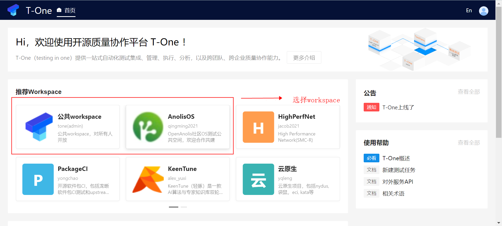

### 1.2 新建测试任务

点新建Job -> 通过Job类型新建 -> 性能测试 -> 性能测试（云上），看图：

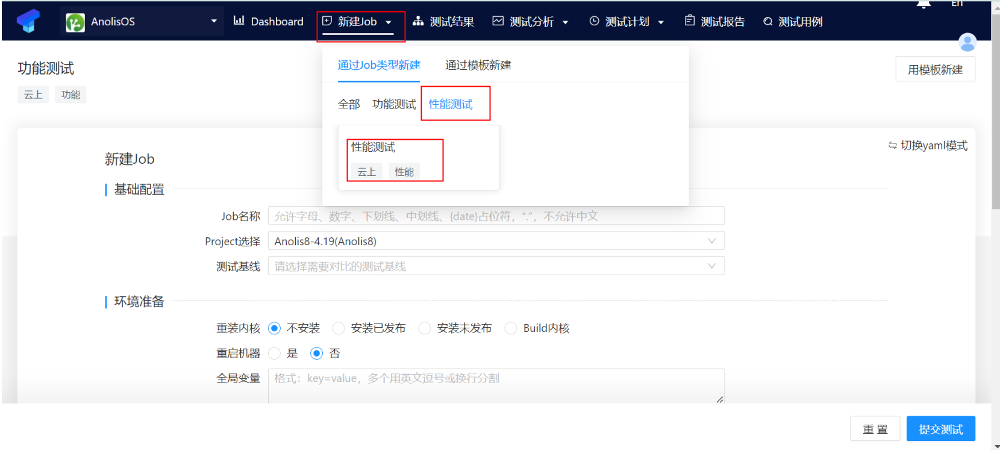

#### 1.2.1 准备测试

发起一个简单的测试任务准备阶段只要配置 job 名称，默认不安装内核不重启机器，如果需要更换测试机的内核可以交由 T-One 平台来执行，再根据自身测试需求选择填写以下几项：
+ **全局变量**：在测试执行前执行 export xxx=xxx 命令，例如有用例通过 SERVER 变量指定服务端的测试机可填写 SERVER=192.168.10.1；
+ **安装RPM**：在测试用例执行前安装指定的软件包，可用于安装测试机 yum 源里没有的软件包；
+ **执行脚本**：在测试用例执行前执行测试所需的脚本，如在关闭一些服务来排除对性能测试的影响；

##### 1.2.1.1 不安装内核

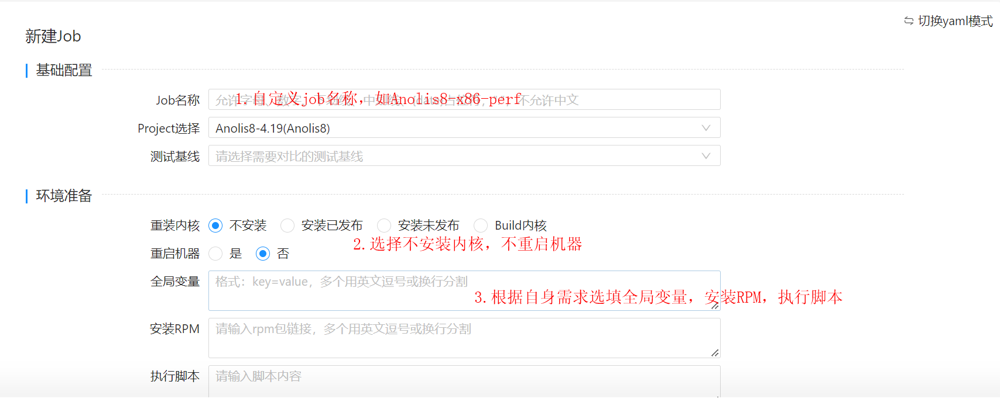

##### 1.2.1.2 安装内核

安装内核时可以在内核脚本中配置启动参数，并选择**安装内核后**执行，看图：

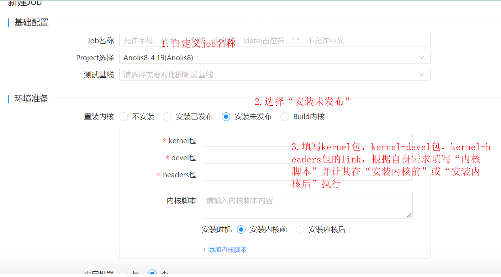

#### 1.2.2 选择测试用例

点选择用例，在右侧出现的下拉框中勾选你想要执行的测试用例，看图：

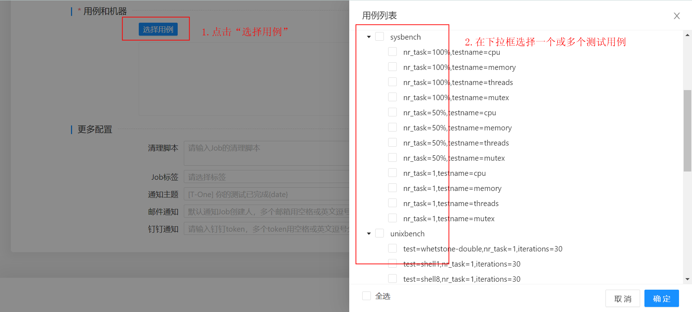

#### 1.2.3 配置测试用例

这个过程主要是配置执行测试用例的机器，当你勾选的测试用例较多时，可以使用**批量配置**，这样操作更为高效，再选择性配置 repeat（每个 test conf 的次数）和执行优先级，一般直接使用默认值，如果你想早点看到测试结果可以配置 repeat 为 1。

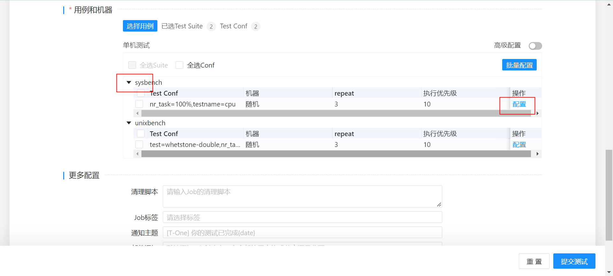

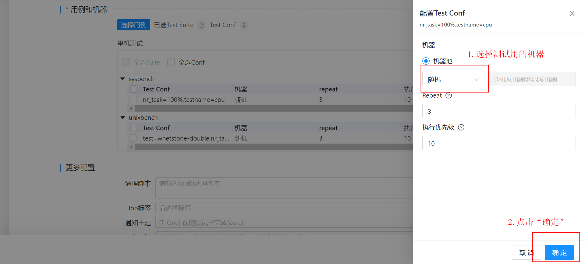

#### 1.2.4 提交测试

在提交测试前可以配置清理脚本、标签、通知主题、邮件地址等等，点击**提交测试**后，可以看到测试结果里的第一个 job 就是你发起的，祝贺你成功发起了第一个龙蜥操作系统 (Anolis OS) 的测试任务，获得“测试新星”的称号。

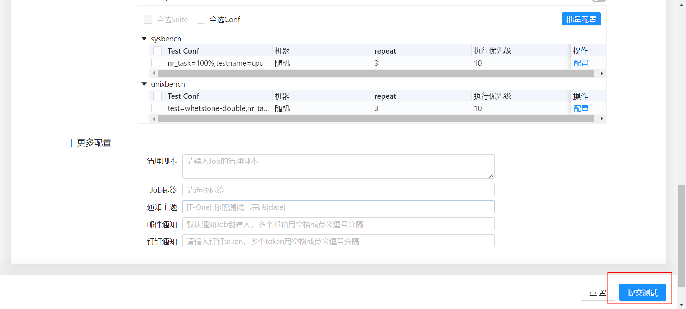

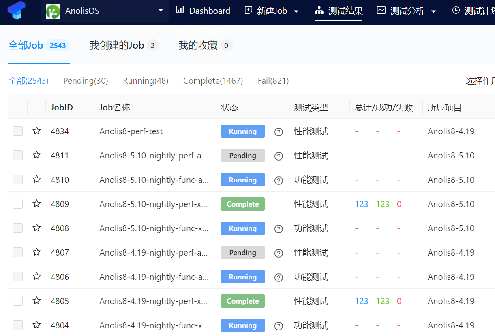

### 1.3 查看测试任务

点击你刚刚发起的测试任务，可以看到机器测试准备过程和测试用例执行的情况，你还可以选择停止/跳过执行，耐心等待测试结束后就可以看到测试数据以及日志。

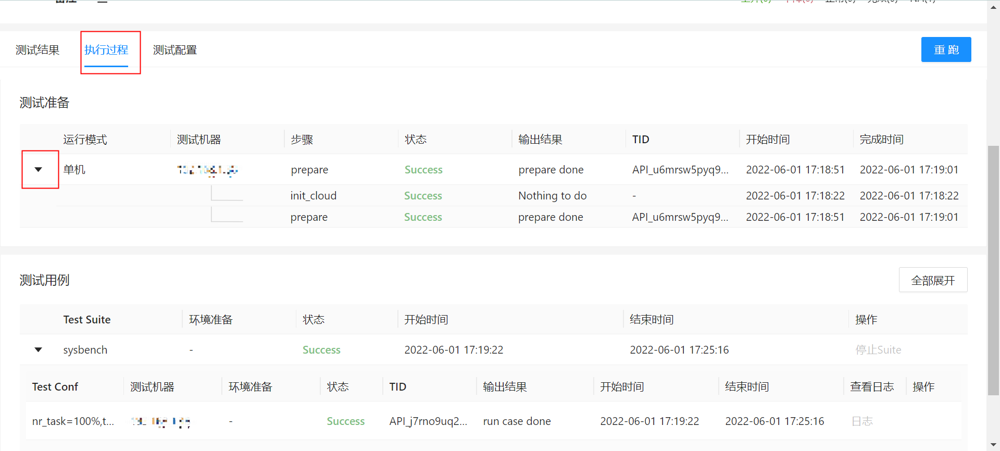

测试结果数值由平均值和波动系数组成，如果你填写的 repeat 数值为 3，那么测试结果是三次用例结果总和除以 3。

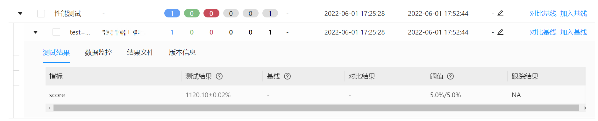

如果想查看测试用例执行时的日志，点结果文件 -> 1 -> stdout.log，看图：

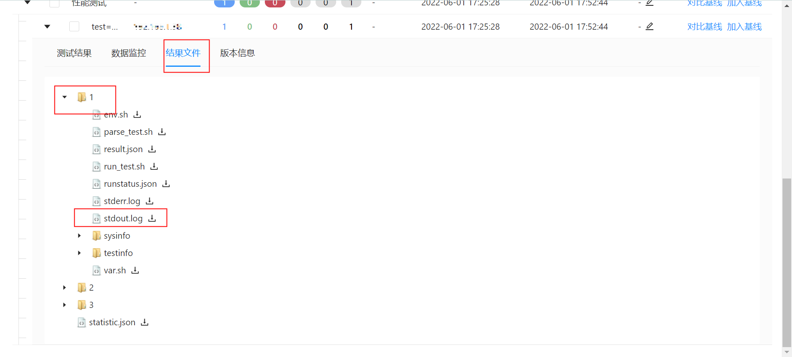

## 2. 对比任务

当你拿到一组测试数据，想和其他操作系统或者内核作比较时，接下来你发起了下一个测试任务。拿到两组以上的测试数据，便可以试一下 T-One 的任务对比功能。下面演示过程选取两个 Anolis8-5.10-nightly-perf-x86_64 相关的历史测试任务，这两个测试任务勾选的用例以及执行用例的机器是一样的，只有内核是不同的，看图：

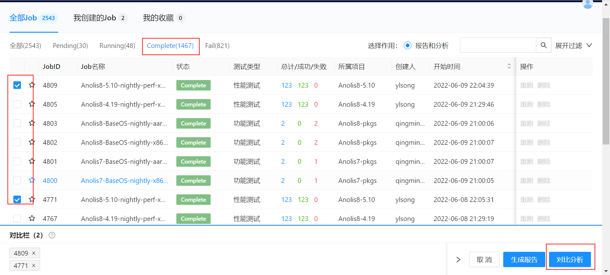

点新建对比组两次，用鼠标拖拽任务分别到对比组1，对比组2，看图：

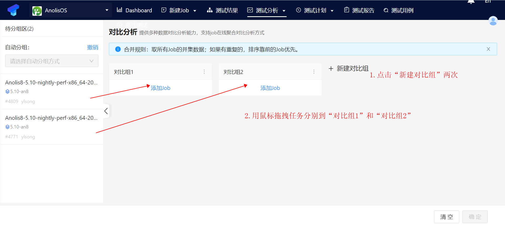

选取一组旧的任务设为基准组，并将组名称修改为 baseline 或者其他名称与另一组区分开来，看图：

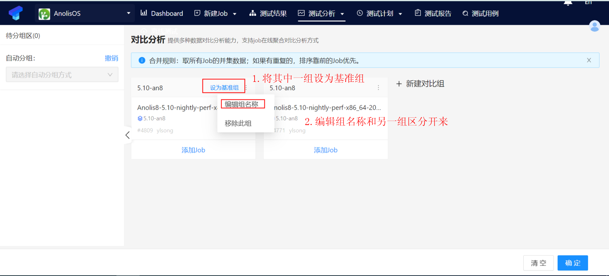

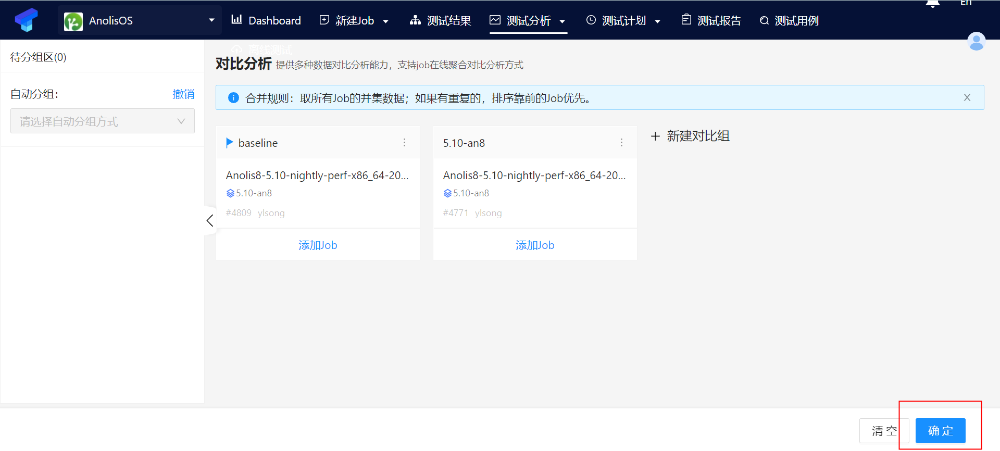

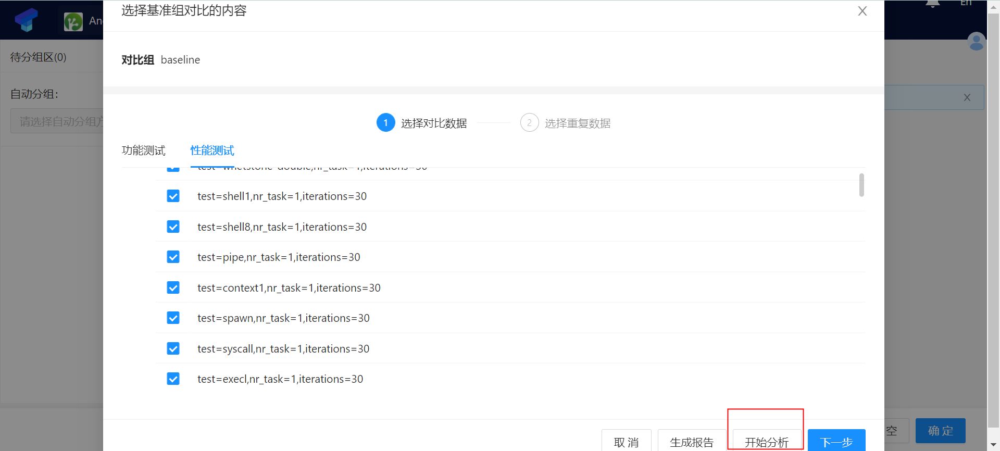