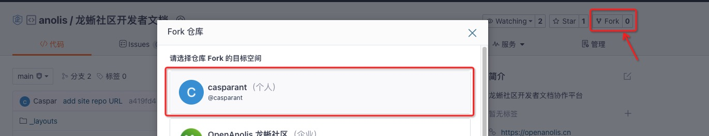
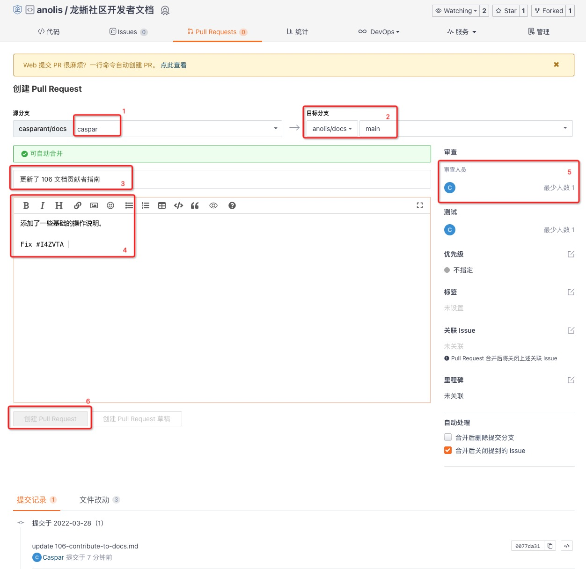

# 106 - 文档贡献者指南

龙蜥开发者文档中心本身也是龙蜥社区开源项目之一，依托 Gitee 平台，接受对文档相关内容的 [Issues](https://gitee.com/anolis/docs/issues) 和 [PR(Pull Requests)](https://gitee.com/anolis/docs/pulls) 提交，最终通过 [Gitee Pages](https://gitee.com/help/articles/4136) 平台分发。本文介绍如何参与到文档贡献者行列中来。

## 1. 本文涵盖和不涵盖的范围 (Scope)

本文仅介绍如何通过 Gitee 向龙蜥开发者文档中心（本站）贡献文档，不涵盖 SIG 组自行组织的内部文档，也不涵盖 [Anolis OS 语雀官方文档](https://yuque.com/anolis-docs)。但是文档规则很多时候是通用的，本文的规范要求很多时候可以复用到其他文档中去。

## 2. 本站组织结构

本站的文档通过 Gitee 管理，源码存放在 [https://gitee.com/anolis/docs/](https://gitee.com/anolis/docs/). 文档通过 Gitee Pages 提供的渲染功能，使用了一个简单的 Jekyll 模板直接渲染。渲染后的页面在 [https://anolis.gitee.io/docs](https://anolis.gitee.io/docs).

本站源码组织结构如下：

```bash
.
├── CONTRIBUTING.md # 贡献者指南导航页
├── COPYING.md      # 文档版权&许可声明
├── FAQ.md          # 常见问题(建设中)
├── README.md
├── _config.yml     # Jekyll 配置文件
├── _layouts        # 网站渲染 HTML 模板
│   └── default.html
├── articles        # 教程、指南等文章主体结构放这里
│   ├── 101-accounts.md
│   ├── 102-join-discussion.md
│   ├── ...
│   ├── ...
│   └── 307-build-a-new-project.md
├── assets          # Jekyll 样式、素材目录
│   └── css
│       ├── style.scss
│       └── ...     # 存放其他样式表需要的文件
└── images          # 存放文档中使用到的图片
    ├── 101-xxx.jpg
    ├── 102-xxx.png
    ├── ...
    └── ...
```

核心的内容在 `CONTRIBUTING.md` 和 `articles/` 目录下的文章。

本站所有的文档工作，都基于代码开发流程，因此代码开发流程中的概念，也适用于本站文档。

本站文档正式发布分支为 `main` 分支，所有的文档代码都应当通过 PR(Pull Requests) 方式提交，经过评审(Review)通过后，合并到 `main` 分支。

## 3. 参与协作的方式

### 3.1 准备工作
首先，你需要注册 Gitee 账号，同时需要在龙蜥网站签署 CLA 协议，也需要注册主站账号。相关账号注册和使用可以参考：
+ 《[101 - 社区账号指南](../articles/101-accounts.md)》
+ 《[202 - Gitee 平台使用指南](../articles/202-intro-to-gitee.md)》

接下来，你需要通过 Git 协作，因此需要掌握 Git 相关知识，`TODO` 目前本站缺乏 Git 相关教程，但是可以先看一些网上的教程：
+ 《[Gitbook 中文版](https://git-scm.com/book/zh/v2)》
+ 《[Gite 帮助中心](https://gitee.com/help/articles/4122)》

### 3.2 了解有哪些文档任务可以参与

常见的文档任务有：文档内容修正、文档翻译、主题文档编写等。想要了解详细的正在进行中的文档任务，可以访问[文档 SIG 组](https://openanolis.cn/sig/docs)，并建议参加 SIG 组的会议。

通过 SIG 组会议，或者通过 [Gitee Issues](https://gitee.com/anolis/docs/issues) 页面，你可能会被分到一个具体的文档工作，这个任务将会在 Issues 页面跟踪。

领到具体 Issue 后，接下来你就可以基于这个任务进行文档开发了。

### 3.3 进行文档开发

前面提到，本站文档所有代码都需要通过 PR 提交，为了便于开发，在进行代码开发前，建议先将本站的源码 fork 到自己的工作空间中，以避免自己的改动意外影响到本站内容。当然，我们已经对官方仓库进行了权限控制，可以最大程度防止意外改动。



+ 如果本次文档任务是基于现有的文章进行完善，或者你发现了已发布文档的 BUG，可以在根目录或者 `articles/` 目录下找到对应的文档，进行修改；
+ 如果你的任务是写一篇新的文档，可以在 `articles/` 目录下创建新的文档，文件名格式为：以三位数字开头（在会议上会提前确定），然后用简单直观的英文表述，中间用'-'连字符，最后以`.md`结尾。例如：`307-build-a-new-project.md`。随后，即可开始相关的文档编写工作。

本站所有的文档，都遵循标准的 Markdown 语法，了解 Markdown 基本语法可以点击[这里](https://www.markdown.xyz/basic-syntax/)。基于 Markdown 语法，我们可以将所有的文档工作都纳入到代码流程中去。完成一次文档编写后，需要以 git commit 的形式保存。建议使用 `git commit -s <path>` 的方式，带上自己的邮箱签名。

Markdown 文档不支持直接插入图片，如需加入图片，需要先保存对应的图片到 `images/` 目录，前缀与本文的数字前缀一致，同样带上简单的英文表述，以连字符'-'相连。随后，在 Markdown 文章中，用以下语法插入图片：
```md

# 注意自己相对于 images/ 目录的层级，确定是否需要使用 ../ 上级目录
```

你也可以在自己 fork 出来的仓库中，部署 Gitee Pages 服务，调试你的文档显示效果。点击 Gitee 页面的“服务”标签，选中 "Gitee Pages" 服务。在弹出的界面中，选择部署分支为自己的开发分支，是否强制使用 HTTPS 可随意，随后点击“更新”，等待部署完成后，会提示调试网站地址。


### 3.4 提交文档审核

在完成文档编写及调试后，需要在 Gitee 页面提交 PR. 发起 PR 的仓库应当是你自己的工作仓库，否则可能会找不到待合并仓库或分支。

PR 页面的入口位于 Gitee 页面上方标签页醒目位置，或者直接输入 https://gitee.com/casparant/docs/pulls (将`casparant` 换成你自己的仓库名)。点击右上角 `新建 Pull Request`.

1. 确认待合并的分支正确；
2. 确认需要合入的仓库和目标分支正确；
3. 填写一个简短有意义的标题；
4. 填写此次合并的内容描述，以及其他你希望让审核人员看到的信息；注意这里最好提一下此次任务是基于哪个 Issue 来工作的，可以在内容中写：`Fix #xxxxx` 字样 (xxxx 为对应 Issue ID)；
5. 如果有指定的审核人员，可以在这里选择；
6. 点击“创建 Pull Request”创建合并请求。



### 3.5 审核文档

审核人员在收到审核请求后，会仔细检查文档的内容和格式是否符合要求。在确认符合要求后，会通过审核。文档将会自动更新到本站页面中。

## 4. 文档格式要求

本章节列出了文档编写过程中的一系列要求。如前面所说，这些要求一定程度上也适用于其他文档的开发工作。

### 4.1 术语规范

OpenAnolis 龙蜥社区相关的术语有如下规范：

+ 社区：
  + **完整名称**： OpenAnolis 龙蜥社区；
  + **简称**（推荐）：龙蜥社区；
  + **简称**（英文或中英文混合场景适用）：OpenAnolis 社区，OpenAnolis Community；
+ 操作系统：
  + **完整名称**：龙蜥操作系统 (Anolis OS)；
  + **带版本完整名称**：龙蜥操作系统 (Anolis OS) V8，龙蜥操作系统 (Anolis OS) V8.2，龙蜥操作系统 (Anolis OS) 8.2 均可；
  + **简称**（推荐）：Anolis OS；
  + **简称**（带版本名称）：Anolis OS 8，Anolis OS 8.2；
  + **简称**（需要强调中文的场景）：龙蜥操作系统，龙蜥 OS。

在第一次出现相关术语的时候，建议使用完整名称，此后可使用简称。

### 4.2 文档写作规范

1. 文档的标题应当为一级标题，即使用 Markdown 语法中的 `#` 号。本文档中所有其他标题，都不应再使用一级标题；
2. 文档的各级标题应当用序号标识，请注意序号应当从 1 开始，避免使用标号 0；
   1. 一级标题举例: `## 1. 示例一级标题`;
   2. 二级标题举例: `### 1.1 示例二级标题`;
   3. 三级标题举例: `#### 1.1.1 示例三级标题`(如果还有下一层级)，或者 `#### a. 示例三级标题`(如果没有下一层级)；
   4. 不建议标题使用过多层级，尽量控制在三级及三级以内。
3. 文档编写过程中，不要求换行（例如100字换行，80字换行），而且我们也不推荐换行操作，对于不同 Markdown 渲染器，换行带来的格式影响是不一致的；
4. 中英文、中文数字混排，**必须**要用空格。即，中文和英文之间，应当使用一个半角空格；中文和数字之间，应当使用一个半角空格。举例如下：
    1. 中英文、中文与数字之间空格规范
        + 正确：Anolis OS 8 是 OpenAnolis 社区发行的开源 Linux 发行版。
        + 错误：Anolis OS 8是 OpenAnolis社区发行的开源Linux 发行版。
    2. 数字与单位之间空格规范
        + 正确：Anolis OS 100% 兼容 CentOS。
        + 错误：Anolis OS 100 % 兼容 CentOS。
        + 正确：Anolis OS 8.6 Boot ISO 大概只有 900 MB。
        + 错误：Anolis OS 8.6 Boot ISO 大概只有 900MB。
5. 标点符号规范
    1. 不重复使用标点符号
        + 正确：Anolis OS 8.6 版本正式发布了！
        + 错误：Anolis OS 8.6 版本正式发布了！！！
    2. 使用全型中文标点符号
        + 正确：Anolis OS 8 操作系统搭载双内核 RHCK（RHEL Compatible Kernel）和 ANCK（OpenAnolis Cloud Kernel）。
        + 错误：Anolis OS 8 操作系统搭载双内核 RHCK(RHEL Compatible Kernel)和 ANCK(OpenAnolis Cloud Kernel)。
6. 嵌入图片的要求，在上一节已经说明；
7. 如果表示突出（但是没有很强烈的强调意味），可以用 `_内容_` 来实现斜体字；如果表示强调，可以用 `**强调**` 来实现粗体字；
8. 文件路径、命令、简短的代码需要使用反引号 '\`' 引用为 inline-quote。例如：`/etc/os-release`, `./execute.sh`；如果是大段代码，需要使用单独的 '\`\`\`' 代码块，并推荐注明对应的代码所属语言。

