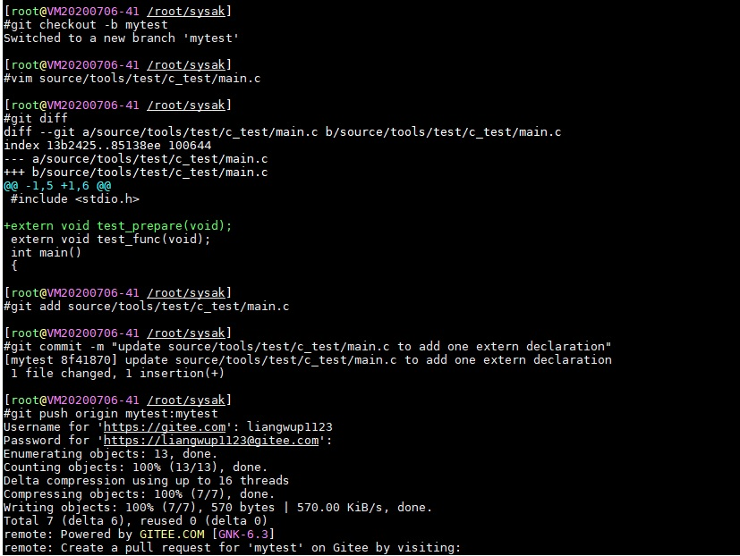
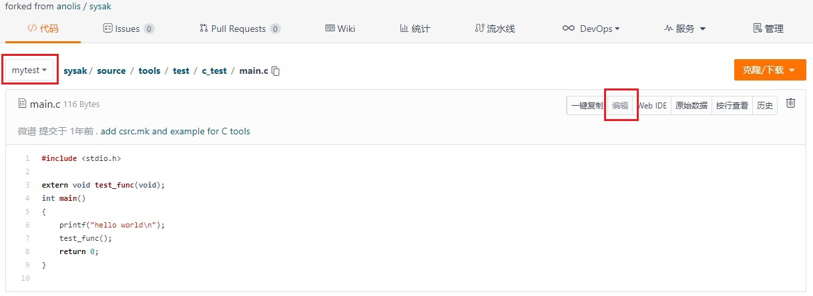
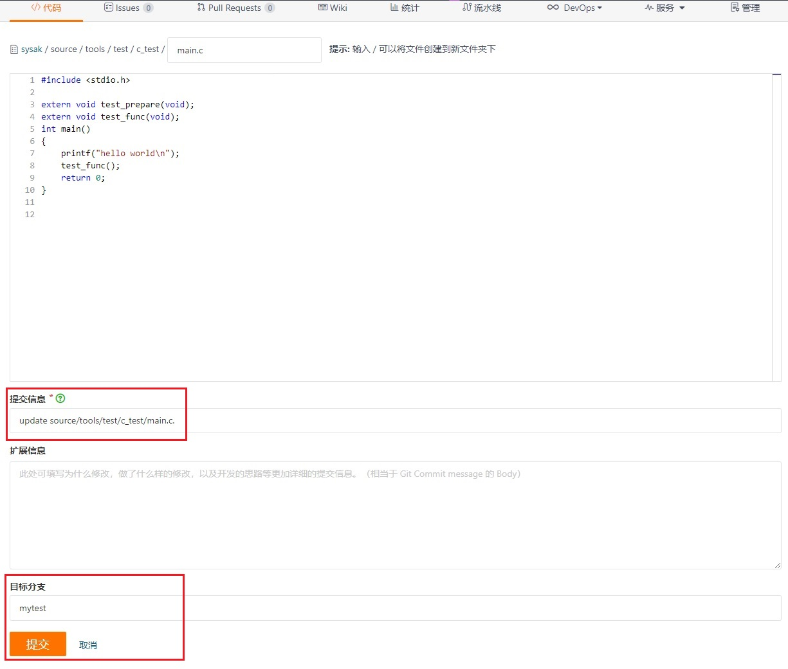
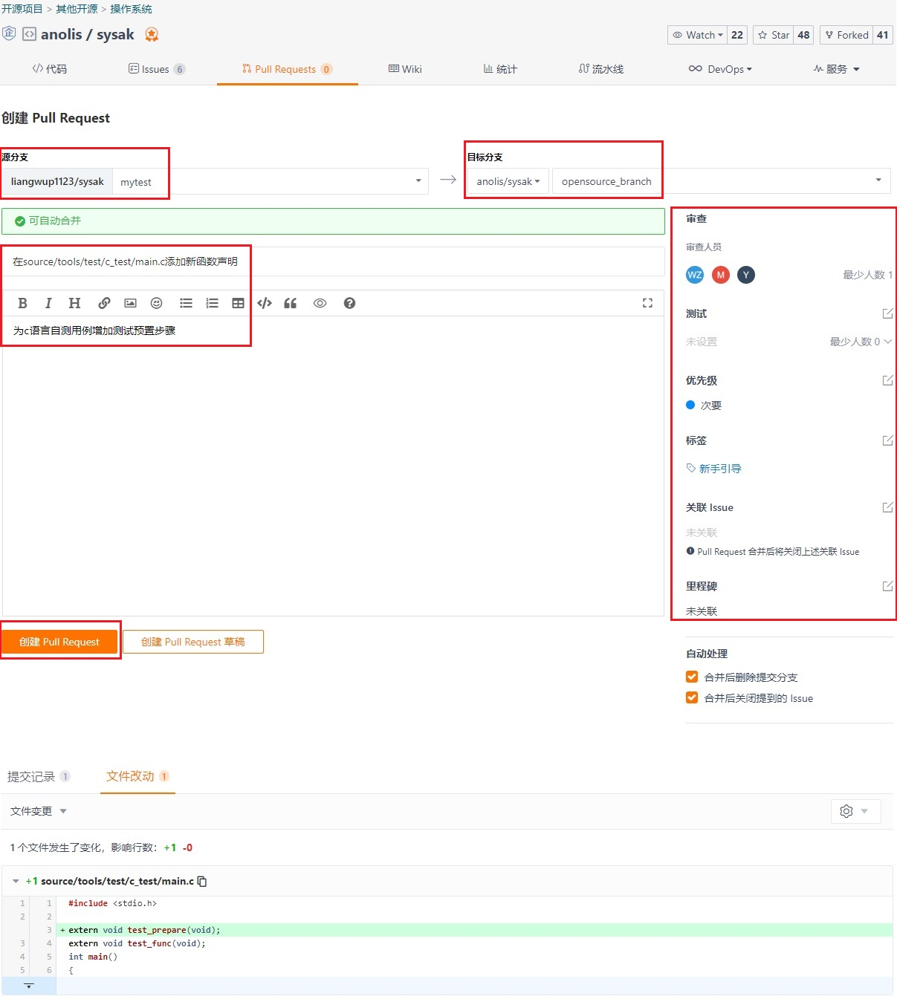

# 206 - 通过 PR 的方式提交代码

[龙蜥社区](https://gitee.com/anolis)目前已拥有 cloud-kernel 、keentuned 、sysak 等众多开源项目，同时我们热衷地欢迎广大贡献者在 Gitee 平台通过 PR(Pull Requests) 的方式提交代码，以促进项目的发展壮大。本文简要介绍关于 PR 提交代码的有关流程和注意事项，希望可作为贡献者的有用指南。

## 1. 声明

文中所述 PR 提交代码应基于贡献者的自愿性原创内容，相关细节可进一步查看 [CLA 协议](https://openanolis.cn/pact/contributor) 页面。

本文主要描述龙蜥社区开源项目 PR 提交相关的普遍性内容，各项目的特殊提交要求请进一步详询相关维护者。

## 2. 参与贡献

### 2.1 准备工作

首先，你需要注册 Gitee 账号，同时需要在龙蜥网站签署 CLA 协议，也需要注册主站账号。相关账号注册和使用可以参考：
+ 《[101 - 社区账号指南](../articles/101-accounts.md)》
+ 《[202 - Gitee 平台使用指南](../articles/202-intro-to-gitee.md)》

接下来，你需要通过 Git 协作，因此需要掌握 Git 相关知识，建议先看一些网上的教程：
+ 《[Gitbook 中文版](https://git-scm.com/book/zh/v2)》
+ 《[Gitee 帮助中心](https://gitee.com/help/articles/4122)》

### 2.2 确认SIG组与项目

建议首先了解项目相关SIG组和项目说明文档，包括项目背景 技术架构 开发计划 示例教程等，并可通过参加 SIG 组会议等方式以跟踪项目的最新动态，以更高效地参与开发中。

### 2.3 进行开发

1. 首先将项目源码仓库 fork 到个人的工作空间中，以避免意外改动对原仓库的影响。操作步骤：
+ 打开代码仓库页面，比如 [anolis / cloud-kernel](https://gitee.com/anolis/cloud-kernel) ;
+ 点击右上角的“fork”，选择个人目标空间并点击确认，完成代码仓库 fork ;
+ 根据需要在开发环境上 git clone 已 fork 的个人代码仓库, 并进行开发调试等工作 ;

2. 具体开发流程因项目而异，可参考以下内容：
+ 《[205 - 开发过程不完全指南](../articles/205-ready-for-first-task.md)》
+ 具体项目开发流程的说明文档，比如 [Cloud Kernel 开发流程](https://gitee.com/anolis/cloud-kernel/wikis/Cloud%20Kernel%20%E5%BC%80%E5%8F%91%E6%B5%81%E7%A8%8B)

   同时你可以借助龙蜥社区提供的其它平台和服务，对所开发内容进行验证，包括并不限于：
+ 在线机器资源服务 [龙蜥实验室](https://lab.openanolis.cn/#/apply/home)
+ 一站式自动化测试平台 [T-one](https://tone.openanolis.cn/)
+ 软件包与镜像构建服务 [ABS](https://abs.openanolis.cn/all_project)

### 2.4 提交 PR 

当完成开发调试、确认待提交内容后，可通过以下步骤进行 PR 提交：

1. 选择以下方式之一，将待提交内容推送至个人仓库：
+ 使用开发环境中的 git 命令行工具

+ 通过 Gitee 页面的在线编辑和提交

2. 在个人仓库的 Gitee 页面分别点击上方的`Pull Requests`  `新建 Pull Request` 以发起 PR , 并补充以下内容：
+ 待合并的源分支
+ 需要合入的仓库和目标分支
+ 提交内容的标题与描述
+ 关联的代码审查/测试人员、优先级、标签、关联Issue等信息
   同时查看提交记录和文件改动部分是否符合预期，无误后点击`创建 Pull Request`

3. 在已创建的 PR 页面按需要进行补充和修改，并跟踪合入状态，参考[示例](https://gitee.com/anolis/sysak/pulls/164)

## 3. 规范与建议

由于 PR 是代码合入更新的入口，也是代码质量保证和协作开发的基石，对于社区的开源项目开发和管理十分重要；因此我们提出以下提交 PR 的一般规范，包括：
+ 提交的源/目标的仓库/分支/评审人/说明信息清晰准确 ;
+ **提交内容无冲突**，如果有请先解决冲突后再提交 ;
+ 符合特定项目的开发/验证流程要求，如CLA检验、代码门禁测试等 ;

相关建议请参考：
+ 《[207 - 让你的代码更快被接受的 N 个建议](../articles/207-how-to-get-codes-merged.md)》
