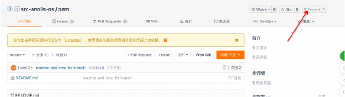

# 使用ABS平台轻松胜任Anolis OS开发工作
## Anolis 源码仓库结构
Anolis OS代码仓库的所在位置是: [https://gitee.com/src-anolis-os](https://gitee.com/src-anolis-os), 如下图，在仓库页面中可以对所有的软件包进行搜索；以pam软件包为例进行说明；

点击进入pam软件包源码仓库，如下图。在针对某个软件包开发之前需要对软件包进行fork操作；

在针对某个软件包开发之前需要对软件包进行fork操作；fork操作会将当前软件包复制一份到开发者仓库中，这样开发者进行修改时就不会影响源位置的代码；

点击fork后，平台弹出一个对话框，选择个人空间后，单击“确认”；fork操作完成后会跳转到如下内容，这个仓库看起来与刚才的仓库没有差异，但是注意左上角有“forked from .....”字样，这意味着这个仓库是派生于一个“上游”仓库的；

## 开始构建一个自己的软件包
ABS（Anolis Build Service），通过ABS平台构建一个龙蜥社区软件包是十分方便快捷的，ABS平台为用户提供了一站式，操作系统软件包开发体验，结合了龙蜥自研的构建系统，ABS平台为用户准备了个人空间，软件包搜索，镜像构建，软件包发布，软件仓库自动化创建等非常实用的功能，大大提升开发者在操作系统研发过程中的效率，统一的构建方式也减少了由于构建环境差异导致的错误；

那么我们一起来看看ABS平台的具体功能吧！ABS位于[这里](https://abs.openanolis.cn/all_project)；

## ABS平台
这是ABS主界面，右上角的登录按钮可以帮助你体验完整的功能，请先行登录；

登录以后，进入个人空间；

## ABS项目
在个人空间中，我们可以建立不同的软件包项目；

给项目取一个，好记的名字！

创建好以后，会在公开项目列表中看到这个新建立的项目；

项目是软件包的集合，也可以理解为是软件包的容器；软件包的构建从创建一个项目开始！

在第一部分复制好的URL可以粘贴在这里喽！注意，分支名称需要保持a23，以便于在Anolis 23系统上进行软件包的编译；

## ABS软件包构建
当添加好一个软件包后，软件包构建就可以开始了，不过在正式开始之前，需要确认配置是否正确，如图：

点击屏幕右侧，项目配置按钮，打开项目配置，使能Anolis 23项目；

配置好以后点击，构建；

进入pam软件包仓库，可以看到对应的软件包编译信息；

## ABS软件包仓库

## 使用对应的软件包

当软件包编译好以后会生成对应的软件包仓库，只要依据配置写好，就可以完成软件包仓库配置，并开始使用阁下亲手编译的软件包；

