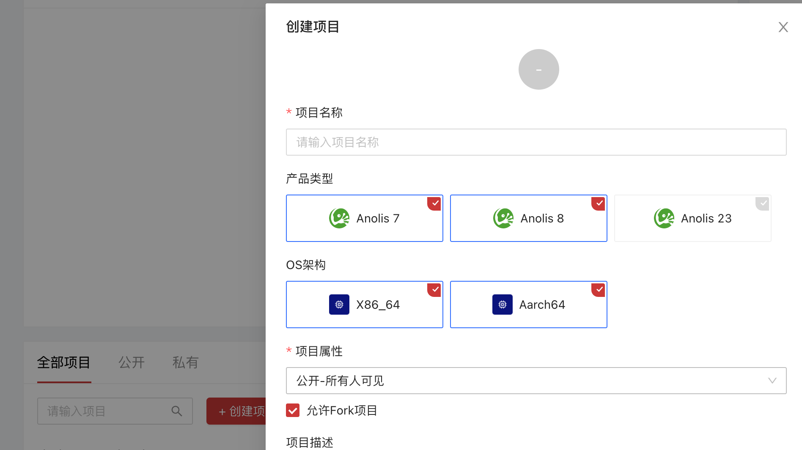
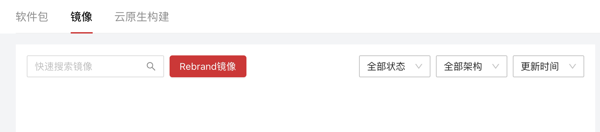
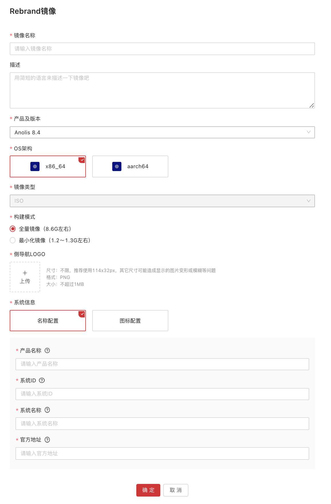
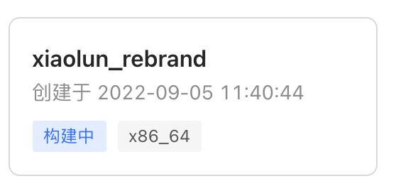
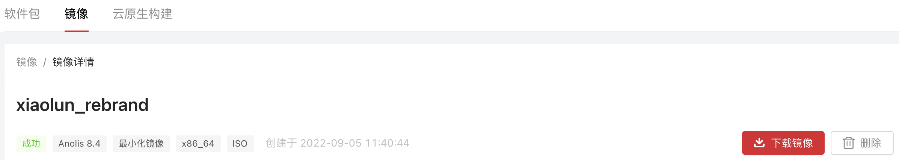
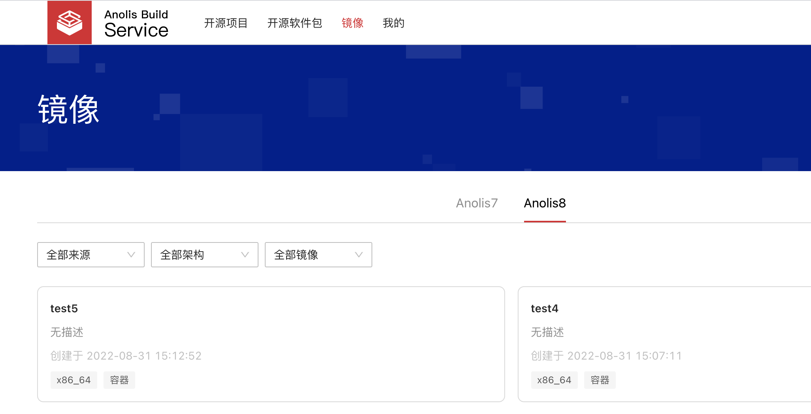

# 使用ABS平台快速一键化 Reband Anolis OS ISO 镜像

## 1.1 使用背景

通过 ABS 前端界面可以一键构建基于 Anolis OS 的用户自己的 ISO 镜像。目前该功能可以支持用户自定义替换 ISO 中的 logo 文字信息以及图片信息。最小化镜像只支持替换显示文字版 logo 信息，全量镜像支持替换文字版 logo 信息以及图形 logo 信息。

## 1.2 操作流程

### 1.2.1 创建项目

用户在[个人空间](https://abs.openanolis.cn/personSpace)页面，点击**创建项目** ，创建一个用于构建 rebrand 镜像的项目。（如果已经创建过项目，则该步骤可以忽略）

### 1.2.2 Rebrand ISO 镜像

1. 进入创建好的项目中，选择**镜像**，并在此页面会展示过往所 rebrand 构建的全部 ISO 镜像。
   
2. 点击 **Rebrand 镜像**后会打开参数配置页面，请按照参数说明填写对应参数。
   
3. 所有参数填写完毕，点击**确定**即可开始构建

> 注：每个用户同时只能构建一个镜像，如需构建多个镜像，请在上一个镜像构建完成之后，再次尝试构建。

### 1.2.3 参数说明

#### 1.2.3.1 基本信息

* 镜像名称

> 必填项，生成镜像文件的名称。

* OS 架构

> 必选项，生成的镜像能够在此架构上安装，支持 x86_64 和 aarch64，更多架构类型正在接入中。

* 产品及版本

> 必选项，基于此产品进行镜像构建，支持 Anolis OS 8.4/8.6，更多产品类型正在接入中。

* 镜像类型

> 必选项，生成镜像的文件格式，支持 ISO 镜像，更多镜像类型正在接入中。

* 构建模式

> 必选项，生成镜像的模式，支持最小化镜像和全量镜像。
>
> 最小化镜像：是指仅包含操作系统发行版的基础应用软件包的镜像，这些基础应用软件包可以保证操作系统正常启动，容量大约为 1 G 左右。
>
> 全量镜像：是指包含了操作系统发行版的所有应用软件包的镜像，容量大约为 8 G 左右。

* 描述

> 选填项，用于本次生成镜像的描述说明。

#### 1.2.3.2 系统配置信息

* 侧导航LOGO

> 选填项，png 类型图片，大小不超过 1 MB，尺寸不限，推荐使用 114 x 32 px，其它尺寸可能造成显示的图片变形或模糊等问题。
>
> 注：用户如果没有上传该图片，系统将会使用 Anolis OS 默认图片。

* 系统信息

> 必选项，用于修改需要 rebrand 包的配置信息，包含名称配置和图标配置。
> 名称配置：用于修改 anolis-release 包中的信息，包含产品名称，系统名称，系统ID，官方地址等参数。
>
> 图标配置：用于修改 anolis-logos 包中的信息，包含产品名称，系统LOGO，系统ICON，桌面背景图等参数。
>
> 注：系统信息至少选择其中一个，可以两个都勾选，如未勾选，则对应的参数会在页面上隐藏，只有勾选配置，才会在镜像 rebrand 中替换对应的信息。

* 产品名称

> 必填项，对应 DIST 字段，例如 Anolis OS 8 的产品名称为 an8。

* 系统名称

> 勾选名称配置后为必填项，在 os-release 中对应 NAME 字段。

* 系统ID

> 勾选名称配置后为必填项，在 os-release 中对应 ID 字段。

* 官方地址

> 勾选名称配置后为必填项，在 os-release 中对应 HOME_URL 字段。

* 系统LOGO

> 勾选图标配置后为必填项，svg 类型图片，大小不超过 1 MB，尺寸不限。

* 系统ICON

> 勾选图标配置后为必填项，svg 类型图片，大小不超过 1 MB，尺寸不限。

* 桌面背景图

> 勾选图标配置后为必填项，png 类型图片，大小不超过 10 MB，尺寸不限，推荐使用 1920 x 1200 px，其它尺寸可能造成显示的图片变形或模糊等问题。

## 1.2.4 查看镜像

1. 参数配置填写完毕，点击**确定**之后，可以在项目镜像中查看已经构建的镜像状态。
   
2. 点击镜像名称，可以查看镜像的详细信息。如果构建成功，可以点击右上角**下载镜像**进行下载；如果构建失败，会在右侧显示失败的原因。
   
3. 可以在 ABS 镜像页面查看其他用户公开构建成功的镜像。
   
