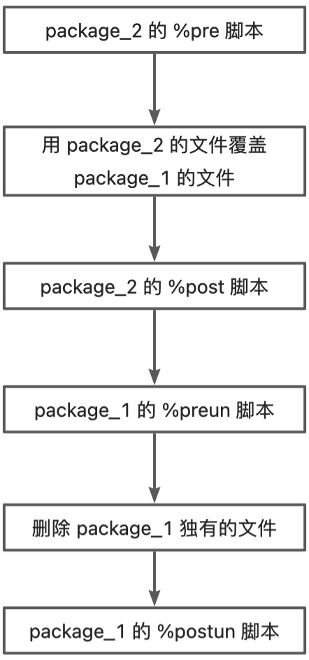

# 306 SPEC 指导手册
该文章介绍了 spec 编写和构建过程中的细节和技术原理，相当于指导手册。
## 1 spec 宏
在软件包构建的过程中，为了防止过多使用硬编码路径和常用路径引用问题，增加了增加了“宏”的概念。将一些常用路径或者变量值通过宏变量定义出来，并可以在整个 Anolis OS 发行版中使用。
spec 宏目前来源于三种：系统宏、各种编程语言的宏和自定义宏
### 1.1 系统宏
当前社区里已经提供了一些系统宏文件，用于在软件包编译过程中使用，包括：系统路径、系统文件、编译选项、编译方式等，下面以 Anolis OS 23 的环境举例。
目前由 rpm 软件对外提供了 spec 定义和编译过程中的宏 ：`/usr/lib/rpm/macros`：

```
// 宏文件路径
[root@localhost ~]$ ls -l /usr/lib/rpm/macros
-rw-r--r--. 1 root root 42715  3月 23 11:05 /usr/lib/rpm/macros

// 查询宏文件所属的 rpm
[root@localhost ~]$ rpm -qf /usr/lib/rpm/macros
rpm-4.17.0-4.an23.x86_64

// 查看宏文件里定义的宏
[root@localhost ~]$ cat /usr/lib/rpm/macros
%_sourcedir             %{_topdir}/SOURCES
%buildroot              %{_buildrootdir}/%{NAME}-%{VERSION}-%{RELEASE}.%{_arch}
%_prefix                /usr
%_exec_prefix           %{_prefix}
%_bindir                %{_exec_prefix}/bin
%_sbindir               %{_exec_prefix}/sbin
%_libexecdir            %{_exec_prefix}/libexec
%_datadir               %{_prefix}/share
%_sysconfdir            /etc
%_sharedstatedir        %{_prefix}/com
%_localstatedir         %{_prefix}/var
%_lib                   lib
%_libdir                %{_exec_prefix}/%{_lib}
%_includedir            %{_prefix}/include
%_infodir               %{_datadir}/info
%_mandir                %{_datadir}/man
.......
```

编译选项相关的基础宏：
```
// 宏文件路径
[root@localhost ~]$ ls -l /usr/lib/rpm/anolis/macros
-rw-r--r-- 1 root root 16707 Mar 16 05:14 /usr/lib/rpm/anolis/macros

// 查询宏文件所属的 rpm
[root@localhost ~]$ rpm -qf /usr/lib/rpm/anolis/macros
system-rpm-config-23-4.an23.noarch

// 查看宏文件里定义的宏
[root@localhost ~]$ cat /usr/lib/rpm/anolis/macros
 GCC toolchain
%__cc_gcc gcc
%__cxx_gcc g++
%__cpp_gcc gcc -E

# Clang toolchain
%__cc_clang clang
%__cxx_clang clang++
%__cpp_clang clang-cpp
.......
```

### 1.2 各种编程语言宏
社区里除了系统软件，对外还提供了很多编程语言的软件，包括不限于：python、perl、go、rust、java 等。
```
// 查询 yum 源里提供的 macros rpm
[root@localhost root]$ yum list | grep macros | grep an23
cmake-rpm-macros.noarch                                                                  3.22.3-1.an23                                                    @BaseOS
efi-srpm-macros.noarch                                                                   5-1.an23                                                         @BaseOS
go-srpm-macros.noarch                                                                    3.0.15-1.an23                                                    @BaseOS
perl-srpm-macros.noarch                                                                  23-1.an23                                                        @BaseOS
pyproject-rpm-macros.noarch                                                              1.0.0-1.an23                                                     @BaseOS
python-rpm-macros.noarch                                                                 3.10-23.1.an23                                                   @BaseOS
python-srpm-macros.noarch                                                                3.10-23.1.an23                                                   @BaseOS
python3-rpm-macros.noarch                                                                3.10-23.1.an23                                                   @BaseOS
rust-srpm-macros.noarch                                                                  23-1.an23                                                        @BaseOS
systemd-rpm-macros.noarch                                                                250.4-1.an23                                                     @BaseOS
fonts-rpm-macros.noarch                                                                  1:4.0.2-1.an23                                                   BaseOS
fonts-rpm-macros.noarch                                                                  1:4.0.2-1.an23                                                   koji
fonts-srpm-macros.noarch                                                                 1:4.0.2-1.an23                                                   BaseOS
fonts-srpm-macros.noarch                                                                 1:4.0.2-1.an23                                                   koji
go-rpm-macros.x86_64                                                                     3.0.15-1.an23                                                    AppStream
go-rpm-macros.x86_64                                                                     3.0.15-1.an23                                                    koji
perl-macros.noarch                                                                       4:5.34.0-6.an23                                                  BaseOS
perl-macros.noarch                                                                       4:5.34.0-6.an23                                                  koji
python-qt5-rpm-macros.noarch                                                             5.15.6-1.an23                                                    koji
qt5-rpm-macros.noarch                                                                    5.15.5-1.an23                                                    koji
qt5-srpm-macros.noarch                                                                   5.15.5-1.an23                                                    koji
texlive-bbm-macros.noarch                                                                9:svn17224.0-1.an23                                              koji
texlive-bbm-macros-doc.noarch                                                            9:svn17224.0-1.an23                                              koji
texlive-chemmacros.noarch                                                                9:svn56983-1.an23                                                koji
texlive-chemmacros-doc.noarch                                                            9:svn56983-1.an23                                                koji
texlive-circuit-macros.noarch                                                            9:svn57308-1.an23                                                koji
texlive-ling-macros.noarch                                                               9:svn42268-1.an23                                                koji
texlive-macros2e-doc.noarch                                                              9:svn46026-1.an23                                                koji
texlive-macroswap.noarch                                                                 9:svn31498.1.1-1.an23                                            koji
texlive-macroswap-doc.noarch                                                             9:svn31498.1.1-1.an23                                            koji
```

### 1.3 自定义宏
允许在 spec 的头部自定义宏变量，通过 `**%global 宏变量名称 宏变量值** `格式定义宏，在下文通过 	`**%{宏变量名称}**`引用，样例：

```
// % %global 宏变量名称 宏变量值 
%global pname ruamel-yaml

// 使用宏变量
Name:           python-%{pname}

// 拓展：
spec 中允许对基本信息字段进行宏拓展使用，比如上述第 5 行的 Name 字段，可以采用 %{name} 进行引用
```

### 1.4 查询已有宏

- 通过 `rpm -E %{xxx}`来查询 xxx 宏的实际内容
   ```
   # 查询 %{_bindir} 的值
   [root@localhost ~]$ rpm -E %{_bindir}
   /usr/bin
   ```

- %bcond_with 和 %bcond_without 介绍

   通常在开启或者关闭某个特性时，可以使用这两个变量。使用方式为：
   ```
   // 定义
   %bcond_without testsuite

   // 使用
   %check
   %if %{with testsuite}
   .....
   %endif
   ```

 - %bcond_without xx ：是指不需要去除 xx 特性，即等价于开启 xx 特性，在定义该宏之后，会在内部自动生成一个全局变量 with_xx ，并对 with_xx 进行赋值 1，即 with_xx =1。这样在使用该变量时，通过with 方法读取 with_xx 变量的值，从而生成判断结果。
 - %bcond_with xx：即关闭 xx 特性，其生成的全局变量 with_xx = 0，从而 with 的判断为假。

## 2 rpmbuild 详解
### 2.1 代码准备
在准备将某款软件进行构建时，需要准备的文件至少为：spec + source.tar.gz，spec文件用于指导生成rpm，source.tar.gz 为源码，有时额外还会存在一些其他 source 文件或者 patch 文件。
下面以 lld 软件作为样例讲解：
```
[root@localhost ~]$ ll ～/rpmbuild/SOURCES/
total 1492
-rw-r--r-- 1 root root    1900 Aug  4 02:10 0001-PATCH-lld-CMake-Check-for-gtest-headers-even-if-lit..patch
-rw-r--r-- 1 root root   20288 Aug  4 02:10 0002-PATCH-lld-Import-compact_unwind_encoding.h-from-libu.patch
-rw-r--r-- 1 root root     699 Aug  4 02:10 lit.lld-test.cfg.py
-rw-r--r-- 1 root root 1473868 Aug  4 02:10 lld-13.0.1.src.tar.xz
-rw-r--r-- 1 root root     566 Aug  4 02:10 lld-13.0.1.src.tar.xz.sig
-rw-r--r-- 1 root root    6129 Aug  4 02:10 lld.spec
-rw-r--r-- 1 root root     488 Aug  4 02:10 README.md
-rw-r--r-- 1 root root    1362 Aug  4 02:10 run-lit-tests
-rw-r--r-- 1 root root    2222 Aug  4 02:10 tstellar-gpg-key.asc
```
### 2.2 %prep 解压
#### 2.2.1 文件准备
%prep 阶段的作用就是准备构建所需要的文件，这里一般包括：
   - 解压 source.tag.gz
   - 打补丁动作
   - 拷贝 source 文件、或者脚本等
#### 2.2.2 解压方式
解压是针对 Souce0 定义的 source.tar.gz 进行解压，解压有两种方式：%setup 和 %autosetup，这两种方式的详细介绍如下，可以根据自己软件需要进行选择使用：

   - `%setup  -q -n %{name}-%{version}`
      - -q ：代表采用安静模式进行解压
      - -n ：声明解压之后的源码目录名称，一般为 %{name}-%{version}，但是可以手动对 source.tag.gz 进行解压后查看具体目录名称
      - 当存在补丁时，需要将每个补丁进行声明打入，并可以针对不同的补丁指定不同的忽略目录，且可以自己指定补丁打入的顺序
      - 在存在与架构相关的补丁时，比较方便，指定对应的架构才将补丁打入用

      ```
      ......
      Patch0: xxxxxx.patch       // 一层路径
      Patch1: xxxxxx.patch       // 两层路径
      Patch2: xxxxxx.patch       // 一层路径
      Patch3: xxxxxx.patch       // 零层路径
      Patch4: x86_64-xxx.patch   // 仅 x86_64 架构打入，一层路径
      ......

      %prep
      %setup  -q -n %{name}-%{version}
      %patch0 -p1
      %patch1 -p2
      %patch3 -p0
      %patch2 -p1
      %ifarch x86_64
      %patch4 -p1
      %endif
      ```

   - `%autosetup -n %{name}-%{version} -p1`
      - -n :  同上
      - -p1：按照 spec 内 Patch 的定义顺序全部打入，并且全部采用 -p1 忽略一层目录的结构打入补丁。
      - 当存在与架构相关的补丁时，不再使用
      - 代码举例：

      ```
      .....
      Patch0: xxxxxx.patch        // 一层路径
      Patch1: xxxxxx.patch        // 一层路径
      ......

      %prep
      %autosetup  -q -n %{name}-%{version} -p1
      ```

   - 此处也可以执行其他动作，比如解压其他 source.tar.gz 、拷贝其他 source 文件等

      ```
      %prep
      %autosetup  -q -n %{name}-%{version} -p1
      tar -xvf %{SOURCE1} ./
      ```

#### 2.2.3 路径信息

- 本地编译时，源码一般存放在 `~/rpmbuild/SOURCES/`下， spec 文件在 `~/rpmbuild/SOURCES/` 或者 `~/rpmbuild/SPECS/`下都可，但是 koji 编译时，spec 文件在`~/rpmbuild/SPECS/`下
- 在执行完 %prep 后，源码将被解压到 `~/rpmbuild/BUILD` 下
- 通常可以使用 `rpmbuild -bp ~/rpmbuild/SOURCES/xxx.spec --nodeps`来查看解压结果，并且可以在日志中看到 patch 是有被打入的。

   ```
   [root@localhost ~]$ rpmbuild -bp ~/rpmbuild/SOURCES/lld.spec --nodeps
   Executing(%prep): /bin/sh -e /var/tmp/rpm-tmp.cJtqDn
   + umask 022
   + cd /root/rpmbuild/BUILD
   + /usr/lib/rpm/redhat/gpgverify --keyring=/root/rpmbuild/SOURCES/tstellar-gpg-key.asc --signature=/root/rpmbuild/SOURCES/lld-13.0.1.src.tar.xz.sig --data=/root/rpmbuild/SOURCES/lld-13.0.1.src.tar.xz
   gpgv: Signature made Wed Feb  2 09:58:19 2022 EST
   gpgv:                using RSA key 474E22316ABF4785A88C6E8EA2C794A986419D8A
   gpgv: Good signature from "Tom Stellard <tstellar@redhat.com>"
   + cd /root/rpmbuild/BUILD
   + rm -rf lld-13.0.1.src
   + /usr/bin/xz -dc /root/rpmbuild/SOURCES/lld-13.0.1.src.tar.xz
   + /usr/bin/tar -xof -
   + STATUS=0
   + '[' 0 -ne 0 ']'
   + cd lld-13.0.1.src
   + /usr/bin/chmod -Rf a+rX,u+w,g-w,o-w .
   + /usr/bin/cat /root/rpmbuild/SOURCES/0001-PATCH-lld-CMake-Check-for-gtest-headers-even-if-lit..patch
   + /usr/bin/patch -p2 -s --fuzz=0 --no-backup-if-mismatch
   + /usr/bin/cat /root/rpmbuild/SOURCES/0002-PATCH-lld-Import-compact_unwind_encoding.h-from-libu.patch
   + /usr/bin/patch -p2 -s --fuzz=0 --no-backup-if-mismatch
   + exit 0
   [root@localhost SOURCES]$ ll ~/rpmbuild/BUILD/
   total 8
   drwxr-xr-x 16 root root 4096 Aug  4 02:44 lld-13.0.1.src
   ```

### 2.3 %build 构建
#### 2.3.1 编译器
软件包使用的编译器由软件源码的语言来决定，现在比较流行的编译器种类比较多：gcc、clang 等。但是，软件包应该默认使用 gcc 作为编译器（对于 gcc 支持的所有语言），如果上游不支持使用 gcc 构建，则应该使用clang。
但是，如果有很好的技术原因，打包者可以选择不使用默认编译器。不使用默认编译器的有效技术原因示例包括但不限于：

- 默认编译器无法正确构建包。
- 打包者需要禁用编译器功能（例如 LTO），以便默认编译器正确编译他们的包。
- 默认编译器需要更长的时间来构建包。
- 默认编译器缺少一个对包有利于的特性。
- 选择使用非默认编译器的打包人员应在spec文件的注释中记录做出这一决定的原因。

#### 2.3.2 编译 Flags

用于构建包的编译器必须遵守系统 rpm 默认配置中设置的编译器 Flags。
对于 C、C++ 和 Fortran 代码,  %optflags 宏包含这些 flags。不鼓励为了性能优化而覆盖这些 flags（例如，-O3 代替 -O2）。如果可以提供 benchmark 结果，显示这段代码有明显的性能优化，那可以根据具体情况重新审视。如果有充分的理由，可以添加、重写或过滤这些flags；这样做的理由必须记录在 spec 文件中。
通常允许使用某些与安全相关的flags，这些flags可能会略微降低性能，但是相对某些程序增加的安全性收益来说是值得的。
默认情况下，启用PIE，如果要在spec中禁用，可以通过：
```
%undefine _hardened_build
```
但是以下场景不允许禁用PIE：

- 软件包长期运行，意味着它很可能会启动并继续运行，直到机器重新启动，而不是按需启动，并在空闲时退出。
- 软件包具有 suid 二进制文件或具有功能的二进制文件。
- 软件包以 root 身份运行。

#### 2.3.3 并行构建

在编译过程中，可以指定多线程来加快构建速度。一般是在 make 后增加 -jxx，来表示用 xx 线程编译，同时可以直接使用 `%make_build` 进行编译，默认增加多线程。
```
[root@localhost SOURCES]$ rpm -E %{make_build}
/usr/bin/make  -j96
```
其他语言也都有对应的编译方式，比如 %cmake_build，%meson_build、%cargo_build 等，这些宏都自带了多线程。

```
[root@localhost ~]$ rpm -E %{cmake_build}
/usr/bin/cmake --build "anolis-linux-build" -j96 --verbose

[root@localhost ~]$ rpm -E %{cargo_build}
/usr/bin/env CARGO_HOME=.cargo RUSTC_BOOTSTRAP=1 RUSTFLAGS='-Copt-level=3 -Cdebuginfo=2 -Ccodegen-units=1 -Clink-arg=-Wl,-z,relro -Clink-arg=-Wl,-z,now --cap-lints=warn' /usr/bin/cargo build -j96 -Z avoid-dev-deps --release
```

#### 2.3.4 构建目录
在构建阶段，所有的构建动作都在路径：`～/rpmbuild/BUILD/%{name}-%{version}/`下，并且编译生成的文件也只允许生成在当前目录下，不允许对构建环境的系统目录进行操作，比如：`/tmp`、` /home`。

#### 2.3.5 网络访问
构建系统中的软件包是在一个模拟的 chroot 中构建的，无法访问互联网。包不能依赖或使用不是它们自己创建的任何网络资源。

### 2.4 %install 预安装
在完成构建后，需要对构建结果进行一个安装，这里准备了一个预安装的环境，用于模拟安装环境。

#### 2.4.1 安装路径
预安装的绝对路径为：`～/rpmbuild/BUILDROOT/%{name}-%{version}/`，一般可以使用 `%{buildroot} `进行引用。

#### 2.4.2 怎么安装
一般该阶段执行的动作都是将文件从**构建目录**拷贝到**安装目录**，举例：
```
install: 
	@echo "BEGIN INSTALL xxx"
	mkdir -p $(BINDIR)

install -m 0755 $(PKGPATH)/xxx $(BINDIR)
```
#### 2.4.3 其他动作汇总
```
%install
%make_install

// 创建路径
mkdir -p %{buildroot}/%{_datadir}/%{name}

// 复制 source 文件到安装目录
install -p -m 0644 %{SOURCE1} %{buildroot}/%{_datadir}/%{name}/

// 新生成文件到安装目录
pushd %{buildroot}/%{_datadir}/%{name}/
touch xxx
popd

// 删除多余文件
rm -f %{buildroot}/%{_libdir}/%{name}/*.{a,la,so}
```

### 2.5 %files 打包

spec 中通过 %files 来规定 package 包含哪些文件，对于 %install 里的文件要求如下：

   - 每个文件只能有一个归属，不可以同时属于两个 package
   - 所有在 %install 阶段安装到 %{buildroot} 下的文件，必须全部都有归属
   - 当然如果想忽略某个 %{buildroot} 下的文件，可以使用 %exclude 进行去除，但不推荐这种方式，建议直接在 %install 阶段里删除对应文件
   - 不允许声明不在 %{buildroot} 下的文件
  
#### 2.5.1 文件系统布局
文件系统层次结构标准（FHS)，定义了 Linux 操作系统中的主要目录及目录内容。[FHS](https://refspecs.linuxfoundation.org/fhs.shtml ) 由 Linux 基金会维护。主要介绍了每个结构的含义和应该存放的文件。

| / | 第一层次结构的根，整个文件系统层次结构的根目录 |
| --- | --- |
| /bin | 需要在单用户模式可用的必要命令（可执行文件）；面向所有用户，例如：cat、ls、cp |
| /sbin | 必要的系统二进制文件，面向管理员用户。例如：init、ip、mount |
| /boot | 引导程序文件，系统引导文件，如内核 vmlinuz、ramfs 文件，initrd，以及 grub（bootloader）；通常划分单独的分区 |
| /dev | 必要设备, 例如：/dev/null，/dev/sda |
| /etc | 系统范围内的配置文件 |
| /home | 用户的家目录，包含保存的文件、个人设置等 <br />每一个用户的家目录通常默认为 /home/$USER |
| /lib | /bin/ 和 /sbin/中二进制文件必要的库文件。 |
| /lib64 | /bin/ 和 /sbin/中二进制文件必要的库文件（64位）。 |
| /lost+found | 系统断电时候临时保存的，默认为空 |
| /media | 可移除媒体(如CD-ROM)的挂载点 |
| /mnt | 临时挂载的文件系统 |
| /opt | 备用目录，第三方程序的安装目录，默认为空 |
| /proc | 虚拟文件系统，将内核与进程状态归档为文本文件。例如：uptime、 network。在 Linux 中，对应 Procfs 格式挂载。<br />/proc/meminfo：查看内存信息<br />/proc/cpuinfo：cpu信息<br />/proc/mounts：挂载信息<br />/proc/loadavg：负载信息<br />/proc/partitions：磁盘信息 |<br />
| /root | 超级用户的家目录 |
| /selinux | selinux 相关的安全策略等信息存储的位置，默认为空 |
| /srv | 为服务提供数据存放位置，默认为空 |
| /sys | 虚拟文件系统，用于输出当前系统上硬件设备相关信息的虚拟文件系统 |
| /tmp | 临时文件(参见 /var/tmp)，在系统重启时目录中文件不会被保留。 |
| /usr | 用于存储只读用户数据的第二层次； 包含绝大多数的(多)用户工具和应用程序。 |
| /var | 频繁发生变化的文件——在正常运行的系统中其内容不断变化的文件，如日志，脱机文件和临时电子邮件文件。<br />/var/cache：应用程序缓存数据目录<br />/var/lib：应用程序状态信息数据<br />/var/local：专用于/usr/local下的应用程序存储可变数据<br />/var/log：日志目录文件<br />/var/log/messages系统日志<br />/var/log/secure 安全日志 SSH连接日志<br />/var/lock：锁文件<br />/var/run：与运行中进程相关的数据；通常存放进程的PID文件<br />/var/spool：应用程序数据池<br />/var/tmp：保存系统两次重启之间产生的临时数据 |

但是也存在一些例外：

- 不允许在/或者/usr下创建目录
- FHS 没有定义 libexecdir，rpm 的宏中包含了 %{_libexecdir} 的定义，Libexecdir（也就是系统上的 /usr/libexec）只应该用作可执行程序的目录，这些可执行程序是由其他程序运行的而不是由用户运行的。
- /run 目录是 tmpfs，系统服务应该存放在该目录，/var/run 是 /run 的软链接。
- /srv、/usr/local、/home/$USER 目录下禁止存放文件或目录
- 有限使用 /opt，/etc/opt，/var/opt，如果想要安装文件到上述目录，最好是创建子目录，比如 /opt/anolis/。
- Anolis OS 23 系统中将 / 下的几个目录与 /usr 下的几个目录合并

   ```
   /bin	
   /usr/bin	%{_bindir}
   /sbin	
   /usr/sbin	%{_sbindir}
   /lib64 or /lib	
   /usr/lib64 or /usr/lib	%{_libdir}
   /lib	
   /usr/lib	%{_prefix}/lib
   ```

- 举例：用户发现 /bin/sh 与 /usr/bin/sh 是同一个文件，如果一个rpm指定
  
   ```
   %files
   /bin/sh
   ```
   可以满足 /bin/sh 的文件依赖，但是无法满足 /usr/bin/sh 的文件依赖。所以 %files 中需要列出历史记录中放置在 /bin，/sbin，/lib 或者 /lib64 的内容；历史记录中放在 /usr/bin，/usr/sbin 目录下的内容以 %{_bindir}、%{_sbindir} 在 %files 中列出。如果对于程序放在哪个目录不清楚，可以通过虚拟的 provides 来列出备用路径，如：
   ```
   .......
   Provides: %{_sbindir}/ifconfig
   .......

   %files
   /sbin/ifconfig
   ```

#### 2.5.2 rpath注意事项

- 不允许使用 rpath。

   rpath 是在链接二进制文件时使用硬编码指定特定的库路径（使用 -rpath 或 -R 标志）。动态链接器和加载器  (ld.so)  会解析可执行文件对共享库的依赖关系并加载所需的内容。但是，当使用 -rpath 或 -R 时，位置信息会被硬编码到二进制文件中，并在执行开始时由 ld.so 检查。由于 Linux 动态链接器通常比硬编码路径更智能，因此我们通常不允许使用 rpath。
   rpmdevtools 软件包中包含一个名为 check-rpaths 的工具，并且在 ~/.rpmmacros 中配置 `%__arch_install_post` 宏：

   ```
   %__arch_install_post            \
   /usr/lib/rpm/check-rpaths     \
   /usr/lib/rpm/check-buildroot
   ```

   运行 check-rpaths 后，可以得到错误提示：

   ```
   ERROR   0001: file '/usr/bin/xapian-tcpsrv' contains a standard rpath '/usr/lib64' in [/usr/lib64]
   ```

   必须删除由 check-rpaths 标记的任何 rpath。

- 允许内部库文件使用 rpath

   有些程序在安装内部库时，通常不会安装在系目录，这些内部库仅被包内程序使用，并不会给外部程序使用，这种情况戏下，可以使用 rpath 来查找这些库。
   ```
   # Internal libraries for myapp are present in:
   %{_libdir}/myapp/
   %{_libdir}/myapp/libmyapp.so.0.3.4
   %{_libdir}/myapp/libmyapp.so

   # myapp has an rpath to %{_libdir}/myapp/
   readelf -d /usr/bin/myapp | grep RPATH
   0x0000000f (RPATH)                      Library rpath: [/usr/lib/myapp]
   ```

- rpath 替代方案

   通常，使用 rpath 是因为二进制文件在非标准位置（标准位置是/lib、/usr/lib、/lib64、/usr/lib64）寻找库。如果需要将库存储在非标准位置（例如 /usr/lib/foo/），则应该在 /etc/ld.so.conf.d/ 中包含一个自定义配置文件。
   例如，如果我将 libfoo 库放在 /usr/lib/foo 中，我就需要在 /etc/ld.so.conf.d/ 中创建一个名为“foo.conf”的文件，文件内容为 '/usr/lib/foo' 。
   ```
   %install
   ......
   mkdir -p ${RPM_BUILD_ROOT}%{_sysconfdir}/ld.so.conf.d
   echo "%{_libdir}/foo" > %{buildroot}%{_sysconfdir}/ld.so.conf.d/%{name}.conf
   ......
   ```

   - 删除 rpath:
      - 如果应用程序包含 configure，configure添加--disable-rpath
      - 如果应用程序使用 libtool，请将以下几行添加到 %configure 之后的spec中

   ```
   %configure
   sed -i 's|^hardcode_libdir_flag_spec=.*|hardcode_libdir_flag_spec=""|g' libtool
   sed -i 's|^runpath_var=LD_RUN_PATH|runpath_var=DIE_RPATH_DIE|g' libtool
   ```

   - 直接修改代码或者Makefile来删除 -rpath 或者-R
   - 作为最后的手段，有一个名为 chrpath 的包。安装此软件包后，对包含 rpath 的文件运行 chrpath --delete。需要在 spec 中增加 `BuildRequires: chrpath` 后，运行：

      ```
      chrpath --delete $RPM_BUILD_ROOT%{_bindir}/xapian-tcpsrv
      ```

#### 2.5.3 权限和属主
所有的目录和文件必须设置正确的权限。

- 每个文件都应该归 root:root 所有，除非出于安全考虑需要更具体的用户或组。
- 目录默认权限为 0755 ，文件默认权限为 0644 ，除非有特定需求
- 所有文件必须可读
- 文件权限方式有几种方式：
   - 在 %install 阶段，通过 chmod 和  chown 等命令修改权限
   - **在 %install 阶段执行拷贝命令时进行赋权限：**`install -m 0644 xxxx`， 建议使用该方式。
   - 在 %files 阶段统一增加 `%defattr(-,root,root)`，统一赋权限，但该项仅对没有默认值的文件生效
   - 在 %files 阶段对单个路径或者配置文件增加权限操作：`%dir %attr(0700, root, root) xxxx`

#### 2.5.4 文件详情
##### 2.5.4.1 license 许可证
因为每款开源软件都是来源于上游社区，并且都含有自己的许可证。所以需要将许可证信息打入 rpm 包中。
一般存在的形式为：COPYING 、License 等，解压开源码包即可查找到。
```
[root@localhost lld-13.0.1.src]$ ll
total 88
drwxr-xr-x  3 root root  4096 Jan 20  2022 cmake
-rw-r--r--  1 root root  7232 Aug  4 02:44 CMakeLists.txt
-rw-r--r--  1 root root   879 Jan 20  2022 CODE_OWNERS.TXT
drwxr-xr-x  2 root root  4096 Jan 20  2022 COFF
drwxr-xr-x  2 root root  4096 Jan 20  2022 Common
drwxr-xr-x  6 root root  4096 Jan 20  2022 docs             -> 这里也别忘记查看一下
drwxr-xr-x  3 root root  4096 Jan 20  2022 ELF
drwxr-xr-x  4 root root  4096 Aug  4 02:44 include
drwxr-xr-x  5 root root  4096 Jan 20  2022 lib
-rw-r--r--  1 root root 15138 Jan 20  2022 LICENSE.TXT       -> 看这里
drwxr-xr-x  3 root root  4096 Jan 20  2022 MachO
drwxr-xr-x  2 root root  4096 Jan 20  2022 MinGW
-rw-r--r--  1 root root   678 Jan 20  2022 README.md
drwxr-xr-x 10 root root  4096 Jan 20  2022 test
drwxr-xr-x  3 root root  4096 Jan 20  2022 tools
drwxr-xr-x  4 root root  4096 Jan 20  2022 unittests
drwxr-xr-x  2 root root  4096 Jan 20  2022 utils
drwxr-xr-x  2 root root  4096 Jan 20  2022 wasm
```

在找到这个文件之后，可以直接使用 %license 的宏将文件从**源码包**目录直接打包至**rpm**包内，不需要再单独执行从编译目录拷贝到安装目录的动作。

```
// 使用样例：
%files
%license LICENSE.TXT
```

##### 2.5.4.2 配置文件

- %config  标志

   配置文件在打包时，可以使用 %config 对配置文件进行标记，%config 额外还提供 %config(noreplace) 的形式，这样可以在软件包升级时不覆盖本地修改。当然是否选择 noreplace，还要根据具体软件包特点来定，推荐使用 %config(noreplace) 。
   但 %config 仅能标记配置文件，其他文件不允许。

   ```
   %files
   %config /etc/%{package_name}/%{package_name}.conf
   %config(noreplace)  /etc/%{package_name}/%{package_name}-noreplace.conf
   ```

- 配置文件的目录

   配置文件建议放到 /etc 下，不允许放在 /usr 下。

##### 2.5.4.3 systemd units

systemd units文件的软件包必须将它们放入 %{_unitdir} 或 %{_userunitdir}。
大多数 systemd 服务应该使用 %{_unitdir}，但是如果服务作为用户运行的话可以使用 %{_userunitdir}。如果想要使用这两个宏，则必须增加其对应的 rpm。

```
[root@localhost ~]$ rpm -E %{_unitdir}
/usr/lib/systemd/system

[root@localhost ~]$ rpm -E %{_userunitdir}
/usr/lib/systemd/user

// 查询哪个 rpm 对外提供系统服务路径
[root@localhost ~]$ cd /usr/lib/rpm
[root@localhost rpm]$ grep -nr '_unitdir'
macros.d/macros.systemd:9:%_unitdir /usr/lib/systemd/system
[root@localhost rpm]$ rpm -qf macros.d/macros.systemd
systemd-rpm-macros-250.4-1.an23.noarch
```

每个 service 文件都会有 scripts 伴随，一般用于设定服务启动时间、执行服务准备脚本等。主要分布在 %post
、%preun、%postun 阶段。

- 系统服务相关脚本

   ```
   BuildRequires: systemd-rpm-macros

   [...]
   %post
   %systemd_post apache-httpd.service

   %preun
   %systemd_preun apache-httpd.service

   %postun
   %systemd_postun_with_restart apache-httpd.service
   ```

   某些服务不支持重启（例如 D-Bus 和各种存储守护进程）。 如果升级时不应重新启动您的服务，请使用以下 %postun 脚本代替上述脚本：

   ```
   %postun
   %systemd_postun apache-httpd.service
   ```

- 用户服务相关脚本

   安装在 %_userunitdir 下的服务也是需要有对应的脚本设置启动或禁用。

   ```
   BuildRequires: systemd-rpm-macros

   [...]
   %post
   %systemd_user_post %{name}.service

   %preun
   %systemd_user_preun %{name}.service
   ```

##### 2.5.4.4 命令行

命令行一般都被包含在主包内，存放路径为：%_bindir 或 %_sbindir，存在部分命令行直接放在 /bin 和 /sbin 下下，/bin 和 /sbin 是作为超链接存在。命令行对外是个可执行的二进制文件，用户根据自己的需求，设置对应的 option，并获取执行结果。
```
[root@localhost rpm]$ rpm -E %{_bindir}
/usr/bin

[root@localhost rpm]$ rpm -E %{_sbindir}
/usr/sbin

[root@localhost rpm]$ ll /bin
lrwxrwxrwx. 1 root root 7 Jun 16  2021 /bin -> usr/bin

[root@localhost rpm]$ ll /sbin
lrwxrwxrwx. 1 root root 8 Jun 16  2021 /sbin -> usr/sbin
```

##### 2.5.4.5 动态库

动态库又叫共享库，一般存放在 %{_libdir} 下。如果为 64 位系统，%_libdir 为 /usr/lib64，如果为 32 位系统，_libdir 为 /usr/lib。但是也存在一些 so 文件，直接放在 /usr/lib 下，没有64 位 和 32 位的区分。
注意：%files 声明 %{_libdir} 下的动态库时，尽量不要使用 * 的统配方式隐藏文件名，比如：libxx.so*。
一般动态库有三种形态，需要严格按照划分方式规定每个 so 的归属。

```
libxxx.so       // 放在 devel 包，开发包，作为超链接直接对外提供，链接到 libxxx.so.1.1
libxxx.so.1     // 放在主包或者 libs 包，作为超链接直接对外提供，链接到 libxxx.so.1.1
libxxx.so.1.1   // 放在主包或者 libs 包，实际掉用的 so，当发生版本变更时，不影响对外提供
```

举例：

```
[root@localhost rpm]$ ll /usr/lib64 | grep libffi
lrwxrwxrwx.  1 root  root         15  3月 14 11:19 libffi.so -> libffi.so.8.1.0
lrwxrwxrwx.  1 root  root         15  3月 14 11:19 libffi.so.8 -> libffi.so.8.1.0
-rwxr-xr-x.  1 root  root      45280  3月 14 11:19 libffi.so.8.1.0

[root@localhost rpm]$ rpm -qf /usr/lib64/libffi.so.8
libffi-3.4.2-1.an23.x86_64
[root@localhost rpm]$ rpm -qf /usr/lib64/libffi.so.8.1.0
libffi-3.4.2-1.an23.x86_64
[root@localhost rpm]$ rpm -qf /usr/lib64/libffi.so
libffi-devel-3.4.2-1.an23.x86_64
```

##### 2.5.4.6 静态库

静态库是指 .a 或者 .la 的文件，存放路径也在 %{_libdir} 下。但是，我们的软件应该尽可能排除掉静态库，即静态库默认不对外提供。
如果想要对外提供静态库，则可以生成 package-static 包，其他依赖静态库的可以在 spec 中增加对  package-static 的构建依赖。
```
[root@localhost ~]$ rpm -ql zlib-static
/usr/lib64/libz.a
/usr/share/licenses/zlib-static
/usr/share/licenses/zlib-static/README

[root@localhost ~]$ ll /usr/lib64/libz.a
-rw-r--r--. 1 root root 383514  3月 15 19:47 /usr/lib64/libz.a
```

##### 2.5.4.7 网络应用程序

一般 Web 应用程序应该将它们的内容放入 `%{_datadir}/%{name}`（即： /usr/share/%{name}  ）中，而不是放在 /var/www/ 下，原因如下：

- /var 应该包含可变数据文件和日志。 /usr/share 更适合这种情况。
- 许多用户有可能已经在 /var/www 中拥有内容，我们不希望任何软件包覆盖用户信息。
- FHS没有定义 /var/www

##### 2.5.4.8 Tmpfiles.d

tmpfiles.d 是用于管理守护进程的临时文件和运行时目录的服务，一般对应的路径为：/run 和 /run/lock。由于 /run 是一个 tmpfs 文件系统，因此每次重新启动时都必须重新创建它及其内容。 通常需要提前创建目录，最好使用 tmpfiles.d 机制来完成。

- tmpfiles.d 机制，对应路径为： %{_tmpfilesdir}
- 在  %{_tmpfilesdir} 下生成 %{name}.conf 文件
- 配置文件的内容为一行或多行相同类型的配置：
   ```
   // d 规定如果目录不存在则创建路径，可以有多种类型
   // /run/NAME 需要创建的文件系统路径
   // PERM 创建目录时的目录权限
   // USER 目录的所有者
   // GROUP 目录所在组的名称
   // - 自动清理在指定时间内未使用的文件
   d /run/NAME PERM USER GROUP -
   ```

- 举例：
   ```
   // 查询 %{_tmpfilesdir} 对应的实际路径
   [root@localhost ~]$ rpm -E %{_tmpfilesdir}
   /usr/lib/tmpfiles.d

   // 查看 /usr/lib/tmpfiles.d 下存在哪些文件
   [root@localhost ~]$ ll /usr/lib/tmpfiles.d/x11.conf
   -rw-r--r--. 1 root root 617  3月 11 15:33 /usr/lib/tmpfiles.d/x11.conf

   // 案例1:
   [root@localhost ~]$ cat /usr/lib/tmpfiles.d/cryptsetup.conf
   d /run/cryptsetup 0700 root root -

   // 案例2:
   [root@localhost ~]$ cat /usr/lib/tmpfiles.d/dnf.conf
   // Unlink the dnf lock files during boot
   R /var/tmp/dnf*/locks/*
   r /var/cache/dnf/download_lock.pid
   r /var/cache/dnf/metadata_lock.pid
   r /var/lib/dnf/rpmdb_lock.pid
   r /var/log/log_lock.pid
   ```

##### 2.5.4.9 locale 文件

rpm 提供了 %find_lang 宏用于处理 locale 文件，%find_lang 能够按名称扫描软件包中所有的 locale 文件，并将列表放入文件中，然后可以通过该文件来打包所有的locale文件。
使用方式： 在 %install 阶段将所有的文件都安装到 %buildroot 后，运行 %find_lang ，并在 %files 阶段将文件打入 rpm。
```
%install
.......
%find_lang %{name}

%files -f %{name}.lang
......
```
 如果 lang 文件与 %{name} 不同，则需要单独调用 %find_lang 脚本
```
%install
.......
%find_lang %{name}
%find_lang test --with-man

%files -f %{name}.lang -f test.lang
......
```

##### 2.5.4.10 cron 文件

cron 文件的存放目录取决于运行时的间隔，可能的目录有：
```
[root@localhost ~]$ ll /etc/ | grep cron
-rw-r--r--.  1 root root      541 Jan 26  2021 anacrontab
drwxr-xr-x.  2 root root     4096 Jun 27  2021 cron.d
drwxr-xr-x.  2 root root     4096 Jun 27  2021 cron.daily
-rw-r--r--.  1 root root        0 Jan 26  2021 cron.deny
drwxr-xr-x.  2 root root     4096 Jun 27  2021 cron.hourly
drwxr-xr-x.  2 root root     4096 Jun 16  2021 cron.monthly
-rw-r--r--.  1 root root      451 Jun 16  2021 crontab
drwxr-xr-x.  2 root root     4096 Jun 16  2021 cron.weekly
```
例外情况：如果某个 cron 的任务的运行频率或者时间间隔不满足上述规定的间隔，则需要自定义  crontab 文件添加到 /etc/cron.d（具有 0640 权限)）,  cron 任务文件（脚本）必须放在适当的系统位置（例如 %{_sbindir}、%{_libexecdir}），而不是 /etc/cron.d。

##### 2.5.4.11 头文件
当我们使用某款软件做开发时，会依赖其对外提供的头文件，这些头文件在系统中的位置一般都是 %{_includedir}( /usr/include )，并且会被封装到 devel 包中，同时 devel 包对于主包是存在运行依赖关系的。
```
[root@localhost ~]$ rpm -ql zlib-devel
/usr/include/zconf.h
/usr/include/zlib.h
.....
```

##### 2.5.4.12 pkgconfig 文件

一般伴随头文件的还有一个 pkgconfig 文件，在系统中的位置为 /usr/lib64/pkgconfig，一般以 %{name}.pc 文件存在，对外提供 pkgconfig(%{name}) 功能。
```
[root@localhost ~]$ rpm -ql zlib-devel
......
/usr/lib64/pkgconfig/zlib.pc
......

// 查询对外提供的 pkgconfig 能力
[root@localhost ~]$ rpm -qP zlib-devel
pkgconfig(zlib) = 1.2.11
zlib-devel = 1.2.11-1.an23
zlib-devel(x86-64) = 1.2.11-1.an23
```

##### 2.5.4.13 example 文件

一般软件的源码中会包含一些测试文档和样本文件，我们也需要将这些 example 文件打入 devel 包中，存在系统的位置为：/usr/share/doc/%{package}-devel/example*，一般源码中会包含 examples 目录，我们也可以将 examples 目录都打入。
```
[root@localhost ~]$ rpm -ql zlib-devel
......
/usr/share/doc/zlib-devel/example.c
......

[root@localhost zlib-1.2.11]$ ll
......
drwxr-xr-x  2 501 games  4096 Aug  8 22:48 examples
......
```

##### 2.5.4.14 doc 文件

一般软件源码中也会包含一些说明性质的文档，来讲述软件的基本功能、修改记录、软件计划节奏等。
包括不限制：readme、changelog、news、todo 等。


### 2.6 脚本执行

在 spec 中除了定义上述中的编译、安装、打包外，还有额外的脚本操作，这些脚本是按照 rpm 安装或者卸载的顺序来执行，一方面是为了准备安装或者卸载所需要的环境条件，另一方面是为了满足软件的运行需求。
一般将脚本定义在 %install 和 %files 中间的位置。

#### 2.6.1 %pre

%pre 是代表 rpm 安装之前所执行的脚本。
格式如下：在 pre 之后可以定义在具体 rpm 所执行的内容，如果 rpm 为重命名的，需要同样采用 -n 选项
```
%pre rpm_name 
xxxx

%pre -n rpm_name
xxxx
```
样例：dbus  生成的 dbus-daemon.rpm 需要设置 dbus 的用户群组
```
%install
......

%pre daemon
// Add the "dbus" user and group
getent group dbus >/dev/null || groupadd -f -g %{dbus_user_uid} -r dbus
if ! getent passwd dbus >/dev/null ; then
    if ! getent passwd %{dbus_user_uid} >/dev/null ; then
      useradd -r -u %{dbus_user_uid} -g %{dbus_user_uid} -d '/' -s /sbin/nologin -c "System message bus" dbus
    else
      useradd -r -g %{dbus_user_uid} -d '/' -s /sbin/nologin -c "System message bus" dbus
    fi
fi
exit 0


......
%files
```

#### 2.6.2 %post

%post 用来声明 rpm 安装后执行的脚本。
样例：在 dbus 的 spec 内，对dbus-comon 安装后需要将对应的服务启动。
```
%post common
%systemd_post dbus.socket
%systemd_user_post dbus.socket
```

#### 2.6.3 %preun

%preun 用来声明 rpm 卸载之前执行的脚本。
样例：在 dbus 的 spec 内，对dbus-comon 安装后需要将对应的服务关闭。
```
%preun common
%systemd_preun dbus.socket
%systemd_user_preun dbus.socket
```

#### 2.6.4 %postun

%postun 用来声明 rpm 卸载之后执行的脚本。
样例：
```
%postun common
%systemd_postun dbus.socket
%systemd_user_postun dbus.socket
```

#### 2.6.5 脚本执行顺序

- 单个 rpm 的脚本执行顺序：

   ```
   // 安装动作
   %pre 脚本 -》 安装文件 -》执行 %post 脚本

   // 卸载动作
   %preun 脚本 -》 删除文件 -》执行 %postun 脚本
   ```

- rpm 升级时的脚本执行顺序:

   


#### 2.6.6 执行状态判断

因为在首次安装或升级时，都要去执行 pre 或 post 操作，为了区分不同的前提状态，脚本里默认增加了变量 "$1" ，在脚本对应阶段通过 "$1" 的判断在安装和升级阶段执行不同的脚本

| 软件包动作 | %pre | %post | %preun | %postun |
| --- | --- | --- | --- | --- |
| 首次安装 | "$1" = 1 | 不适用 | "$1" = 1 | 不适用 |
| 升级 | "$1" = 2 | "$1" = 1 | "$1" = 2 | "$1" = 1 |
| 卸载 | 不适用 | "$1" = 0 | 不适用 | "$1" = 0 |


## 3 常见问题汇总

### 3.1 rpmbuild 基础知识

#### 3.1.1 为什么需要了解 rpmbuild ？

rpmbuild 提供了本地生成 rpm 的功能，可以实现从 spec + source.tar.gz 生成对应的 rpm 文件。

#### 3.1.2 环境初始化

准备 rpmbuild 的运行所需要的目录结构，通常 SOURCES 是必须的目录，其他路径在运行过程中会自动生成。

- 方案1 - 手动创建目录结构
   ```
   [root@localhost ~]$ mkdir rpmbuild
   [root@localhost ~]$ mkdir rpmbuild/SOURCES
   ```

- 方案2 - 通过 rpmdevtools 中的 rpmdev-setuptree 命令生成
   ```
   [root@localhost ~]$ yum install rpmdevtools
   [root@localhost ~]$ rpmdev-setuptree
   [root@localhost ~]$ ll rpmbuild/
   total 20
   drwxr-xr-x 2 root root 4096 Aug 15 02:12 BUILD
   drwxr-xr-x 2 root root 4096 Aug 15 02:12 RPMS
   drwxr-xr-x 2 root root 4096 Aug 15 02:12 SOURCES
   drwxr-xr-x 2 root root 4096 Aug 15 02:12 SPECS
   drwxr-xr-x 2 root root 4096 Aug 15 02:12 SRPMS
   ```

#### 3.1.3 目录结构介绍

实际使用目录介绍：
```
[root@localhost ~]$ ll /root/rpmbuild/
总用量 0
drwxr-xr-x. 3 root root  28  8月  9 14:54 BUILD            ## 源码编译目录
drwxr-xr-x. 2 root root   6  8月  8 14:51 BUILDROOT        ## 源码预安装目录
drwxr-xr-x. 2 root root   6  7月 28 17:48 RPMS             ## rpm 产物目录
drwxr-xr-x. 4 root root 174  8月  9 19:38 SOURCES          ## 源码文件目录
drwxr-xr-x. 2 root root   6  7月 28 17:48 SPECS            ## spec 目录
drwxr-xr-x. 2 root root  47  8月  8 14:51 SRPMS            ## srpm 目录
```

#### 3.1.4 安装 rpmbuild

初始环境中不会默认安装 `/usr/bin/rpmbuild`，需要开发者自行安装 `rpm-build`软件。 
```
[root@localhost ~]$ yum install rpm-build
```

#### 3.1.5 使用介绍

rpmbuild 针对 spec 里的每一个阶段都提供了对应的 option，可以方便的按需执行到对应阶段。

- 准备阶段

将 source.tar.gz 和 spec 拷贝至 SOURCES 目录后，执行 rpmbuild 命令会生成其他目录结构。

- 构建相关的基本命令
   ```
   rpmbuild -bp xxx.spec              // 执行完 %prep，解压和打补丁
   rpmbuild -bb xxx.spec              // 执行完 %build，执行到编译动作结束
   rpmbuild -bi xxx.spec              // 执行完 %install，执行到安装动作结束
   # srpm 是将所有 source 文件打成一个压缩包
   rpmbuild -ba xxx.spec              // 全部执行，生成 srpm 和 rpm
   rpmbuild -bs xxx.spec              // 只生成 srpm
   rpmbuild -bl xxx.spec              // 检验文件是否齐全
   ```

- 拓展功能，以下为比较常用的选项介绍
   ```
   -buildroot=DIRECTORY               // 自定义 build root 的目录
   -clean                             // 完成打包后清除BUILD下的文件目录
   -nobuild                           // 不执行 build 阶段
   -nodeps                            // 忽略掉构建依赖
   ```

### 3.2 补丁

#### 3.2.1 什么是补丁？

在源码中经常能看到后缀为 .patch 的文件，这些文件即是补丁文件。样例如下：
```
[root@localhost tbb]$ ll
total 5360
-rw-r--r--  1 root root     488 Jul 27 07:14 README.md
-rw-r--r--  1 root root    2677 Jul 27 07:14 tbb-2019-dont-snip-Wall.patch
-rw-r--r--  1 root root     670 Jul 27 07:14 tbb-2019-test-task-scheduler-init.patch
-rw-r--r--  1 root root    1864 Jul 27 07:14 tbb-2019-test-thread-monitor.patch
-rw-r--r--  1 root root 2639737 Jul 27 07:14 tbb-2020.3.tar.gz
-rw-r--r--  1 root root    2883 Jul 27 07:14 tbb-2020-attributes.patch
-rw-r--r--  1 root root    2883 Jul 27 07:14 tbb-mark-empty_task-execute-with-gnu-used.patch
```

补丁格式详解：
总包含两大块：补丁头 + 实际修改内容。
其中补丁头用于描述补丁的基本信息，查看这里就能清楚的获取补丁的制作人、制作时间和实现的功能。
实际修改内容中包括：修改的文件路径 + 内容
修改文件这里是默认采用源码包解压后的第一层目录作为相对目录进行，通常在打入补丁时采用 -px 来指定忽略 x 层路径。
```
From git log 信息
From:      patch 制作者
Date:      patch 的生成日期
Subject:   修改的简要描述

---
           git diff 生成的文件差异信息
           
diff --git 修改前文件路径 修改后文件路径
--- 修改前文件路径
+++ 修改后文件路径
@@ index @@ index 对应的代码行
实际代码
```
样例：

```
[root@localhost tbb]$ cat tbb-mark-empty_task-execute-with-gnu-used.patch
From db2f2116adfb545bb76c92205f91e3e3f0f9e44a Mon Sep 17 00:00:00 2001
From: Thomas Rodgers <rodgert@twrodgers.com>
Date: Wed, 2 Jun 2021 15:18:30 -0700
Subject: [PATCH] Mark tbb::empty_task::execute with [[gnu::used]]

---
 include/tbb/task.h | 3 +++
 1 file changed, 3 insertions(+)

diff --git a/include/tbb/task.h b/include/tbb/task.h
index 5e137c6..5b60163 100644
--- a/include/tbb/task.h
+++ b/include/tbb/task.h
@@ -1040,6 +1040,9 @@ inline void task::resume(suspend_point tag) {
 //! task that does nothing.  Useful for synchronization.
 /** @ingroup task_scheduling */
 class __TBB_DEPRECATED_IN_VERBOSE_MODE empty_task: public task {
+#if __has_cpp_attribute(gnu::used)
+    [[gnu::used]]
+#endif
     task* execute() __TBB_override {
         return NULL;
     }
--
2.31.1
```

#### 3.2.2 为什么要有补丁文件？

因为 OS 体系是由众多第三方开源软件组成的，这些第三方开源软件都是有自己的维护者的。
那么 Anolis OS 作为发行者的角色，只能从开源社区取到完整的 source.tar.gz，这些 source.tar.gz 是不允许直接解压开直接修改的，所以针对 source.tar.gz 所有的修改都要通过 patch 的途径进行。

#### 3.2.3 如何制作补丁？

- 首先，将源码包解压开，如果有前缀补丁，需要将其先打入。

   ```
   // 先将源代码拷贝到 ～/rpmbuild/SOURCES/
   [root@localhost tbb]$ cp * /root/rpmbuild/SOURCES/

   // 执行解压动作
   [root@localhost tbb]$ rpmbuild -bp tbb.spec --nodeps
   Executing(%prep): /bin/sh -e /var/tmp/rpm-tmp.W4Pc3T
   + umask 022
   + cd /root/rpmbuild/BUILD
   + cd /root/rpmbuild/BUILD
   + rm -rf oneTBB-2021.5.0
   + /usr/bin/gzip -dc /root/rpmbuild/SOURCES/v2021.5.0.tar.gz
   + /usr/bin/tar -xof -
   + STATUS=0
   + '[' 0 -ne 0 ']'
   + cd oneTBB-2021.5.0
   + /usr/bin/chmod -Rf a+rX,u+w,g-w,o-w .
   + sed -i 's/version\s*="0.2"/version = "2021.5"/' python/setup.py
   + sed -i '1{/^#!.*env python/ d}' python/TBB.py python/tbb/__init__.py python/tbb/__main__.py python/tbb/pool.py python/tbb/test.py
   + exit 0
   ```

- 进入解压后的目录下，进行 git 初始化

   ```
   // 这里 v2021.5.0.tar.gz 解压完后的目录名称为 oneTBB-2021.5.0
   [root@localhost tbb]$ cd /root/rpmbuild/BUILD/oneTBB-2021.5.0/

   // 执行 git 初始化
   [root@localhost oneTBB-2021.5.0]$ git init
   Initialized empty Git repository in /root/rpmbuild/BUILD/oneTBB-2021.5.0/.git/
   [root@localhost oneTBB-2021.5.0]$ git add .
   [root@localhost oneTBB-2021.5.0]$ git commit -m "init"
   ```

- 此时可以按照自己需要修改源码，修改之后通过 `git status` 或 `git diff`查看修改内容，如果想把多处修改合并到一个 patch 里，此处可以将要修改的文件都改了。

   ```
   // 这里样例就随意修改了～
   [root@localhost oneTBB-2021.5.0]$ git status
   On branch master
   Changes not staged for commit:
   (use "git add <file>..." to update what will be committed)
   (use "git restore <file>..." to discard changes in working directory)
      modified:   README.md

   no changes added to commit (use "git add" and/or "git commit -a")
   ```

- 提交本地修改

   ```
   [root@localhost oneTBB-2021.5.0]$ git add .
   [root@localhost oneTBB-2021.5.0]$ git commit -m "modify the README.md"
   [master 171249b] modify the README.md
   1 file changed, 5 insertions(+)
   ```

- 生成补丁，HEAD^ 代表将最近的 一次生成补丁，-o 后面为补丁输出路径。
  
   ```
   [root@localhost oneTBB-2021.5.0]$ git format-patch -n HEAD^ -o /root/rpmbuild/SOURCES/
   /root/rpmbuild/SOURCES/0001-modify-the-README.md.patch
   ```

- 查看补丁内容

   ```
   root@localhost oneTBB-2021.5.0]$ cat /root/rpmbuild/SOURCES/0001-modify-the-README.md.patch
   From 171249bd0bf1641b52697710d399d832d1b85914 Mon Sep 17 00:00:00 2001
   From: "xxx.test" <xxx.test@linux.com>
   Date: Wed, 10 Aug 2022 05:22:25 -0400
   Subject: [PATCH 1/1] modify the README.md
   README.md | 5 +++++
   1 file changed, 5 insertions(+)
   diff --git a/README.md b/README.md
   index dd5156f..b024027 100644
   --- a/README.md
   +++ b/README.md
   @@ -4,6 +4,11 @@
   oneAPI Threading Building Blocks (oneTBB) lets you easily write parallel C++ programs that take xxxxxxxx
   full advantage of multicore performance, that are portable, composable and have future-proof scalability.

   +##############
   +this is test
   +##############
   +
   +
   #### Release Information
   Here are [Release Notes]( https://software.intel.com/en-us/articles/intel-oneapi-threading-building-blocks-release-notes) and
   [System Requirements](https://software.intel.com/en-us/articles/intel-oneapi-threading-building-blocks-system-requirements).
   --
   2.27.0
   ```


#### 3.2.4 如何打补丁？

- 源码方式打入补丁

   可以通过 `git apply`命令在源码中将补丁打入

   ```
   // 解压源码，并将以前补丁打入
   [root@localhost SOURCES]$ rpmbuild -bp tbb.spec --nodeps

   // 进入解压后的目录
   [root@localhost SOURCES]$ cd /root/rpmbuild/BUILD/oneTBB-2021.5.0/

   // 检查补丁
   [root@localhost oneTBB-2021.5.0]$ git apply --check /root/rpmbuild/SOURCES/0001-modify-the-README.md.patch

   // 打入补丁
   [root@localhost oneTBB-2021.5.0]$ git apply /root/rpmbuild/SOURCES/0001-modify-the-README.md.patch
   ```

- 通过 spec 方式打入补丁

   参见 2.2 章节中的 %prep 介绍。

### 3.3 构建问题

#### 3.3.1 构建环境是什么？

构建环境是一个相对“干净”的环境，因为是从 chroot 生成的，该环境仅仅用于源码构建，不用于其他用途。

#### 3.3.2 构建环境里安装的软件是在哪里指定的？

构建环境是来源于两处：**默认安装** + **spec 中 BuildRequires 指定**。默认安装是我们针对所有软件包构建的一个基础编译环境，只包含编译工具链的软件；每个软件可以将自己构建需要引入的软件包都写到 BuildRequires 中，则构建环境会去安装这些软件，从而共同组成了构建环境。

#### 3.3.3 我如果想在构建环境中增加软件，该如何做？

在编译的过程中，经常会遇到缺少某个头文件或者某个动态库，再或者某个二进制的情况，这是我们需要将缺少的文件所属的 rpmpackage 添加到 BuildRequires 中，然后重新发起构建即可。
举例： 假设当前缺少 /usr/include/ncursesw/etip.h，可以通过 `dnf`查询改文件的所属，并将该软件写到 BuildRequires 中。
```
$ dnf repoquery --whatprovides '/usr/include/ncursesw/etip.h'
上次元数据过期检查：1:26:21 前，执行于 2022年08月10日 星期三 12时45分43秒。
ncurses-devel-0:6.3-2.an23.x86_64
```

#### 3.3.4 在构建环境里的软件版本不满足我的需求怎么办？

软件（A）包在构建的过程中，可能需要指定某个构建依赖包（B）的版本的版本号，这时发现构建环境里安装的这款软件和预期版本不满足，此时，需要我们先把依赖包准备出对应的 rpm 后，再来编译原本的软件。

- B 大于 A

这种场景下优先建议 A 软件进行适配 B 软件。因为高版本的 B 软件已经发布，整个 OS 内的其他软件已经依赖了高版本的 B，降级和多版本共存的场景都不满足 OS 发行版的要求，而且从软件的长远发展路线来看，去适配最新版本也是最好的选择。

- B 小于 A

这种场景下建议先将软件包 B 进行基线升级，升级到满足 A 的要求的版本，但是进行基线升级时，需要进行全面的影响评估，请勿对其他软件产生影响。

#### 3.3.5 我需要在构建环境中执行外网操作怎么办？

结论：不允许出现访问外网操作。
因为构建环境是一个模拟的chroot中构建的，无法访问互联网，同时也不允许从外网直接下载依赖的操作，这里的外网操作包括但不限制如下：配置境外、国内的任何一个远端源（pip、nodejs、rust、maven 等），wget 下载、curl 下载等等。

#### 3.3.6 如果我必须下载很多外部源怎么办？

对于还在孵化期的软件，我们允许将所有构建依赖下载到本地，然后通过 offline 模式指定本地的路径进行编译。但该动作需要得到 OS 产品接口人的许可，方可执行。
当前以 go 语言举例，其他语言参照

- 先在联网环境下，进入到源代码目录下，下载对应的依赖，并放到本地的 vendor 目录下
```
go mod vendor
```

- 关闭互联网，然后执行离线构建（这里需要根据不同语言，选择不同的离线方式）
```
go build -mod=vendor
```

- 在上述两步执行成功之后，将 vendor 目录生成压缩包，作为 spec 的第二个source，并将离线构建方式写入

   ```
   ......
   Source0:    package.tar.gz
   Source1:    package_vendor.tar.gz
   .......


   %prep
   %autosetup -n %{name}-%{release}
   tar -xvf %{SOURCE1} ./

   %build
   go build -mod=vendor
   ```

- rpmbuild 构建或者 koji 构建测试，待成功后提交代码

#### 3.3.7 构建过程中提示没有权限怎么办？

当构建过程中提示权限不足时，第一想法都是怎么去提高构建权限，这种想法是不对的。因为，所有发行版的正式构建都是以 build 用户执行的，是不允许操作系统环境的，只允许在构建目录下操作。
所以，应该去排查是哪里操作了系统目录，然后将该动作的修改到构建目录下。
