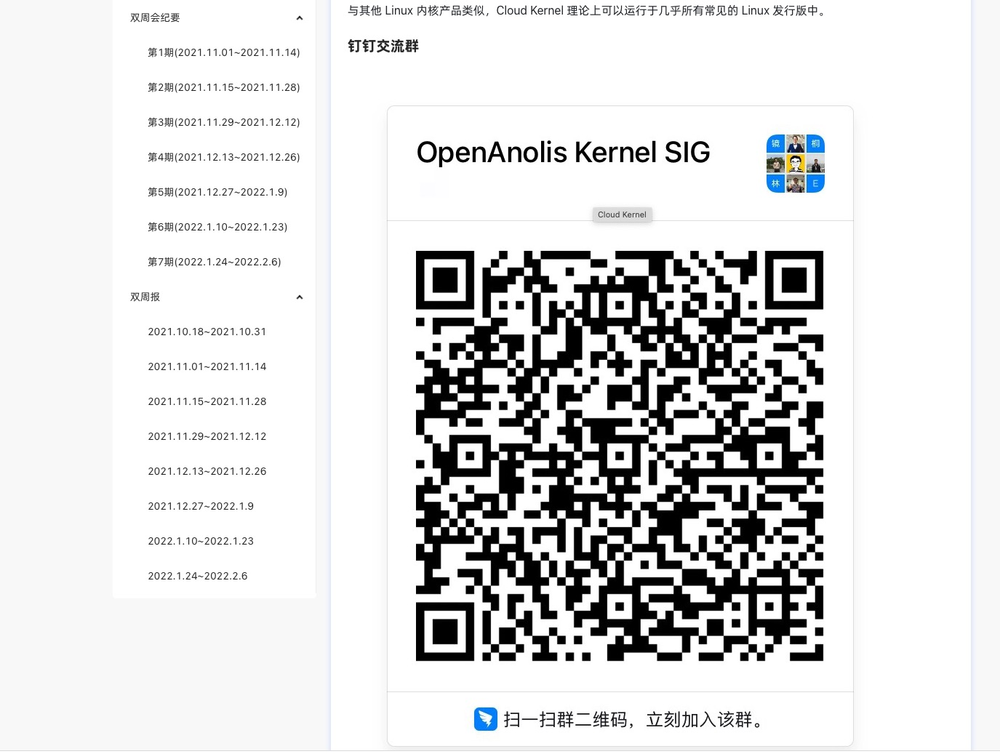

# 102 - 社区讨论途径

常见的沟通途径有同步（在线）沟通和异步（离线）沟通。龙蜥社区提供了丰富的沟通方式，欢迎所有社区爱好者加入相关讨论。

## 1. 在线沟通方式

即时通讯工具(Instant Messager, IM)是在线沟通的主要方式。国内社区常见的即时通讯工具，都有群组功能，这也是龙蜥社区使用的方式。目前龙蜥社区官方的在线沟通群组有：

+ 钉钉群，群号：`33311793` （_龙蜥OpenAnolis社区交流群_）；
+ 微信群：需要添加龙蜥社区助理_龙蜥社区\_小龙_(微信号: `openanolis_assis`)，备注【龙蜥】，然后由小龙添加到讨论群中：
  + Anolis OS开发者&用户社区1群（已满）；
  + Anolis OS开发者&用户社区2群。

**注**: 由于在线沟通的便利性，如需快速提问或者发起一些非正式的话题，在群组里讨论是比较合适的。但是在线沟通也有其效果不好的一面：由于在线沟通的形式较为随意，话题组织较为松散，且聊天记录难以追溯和查找，对于特定主题的话题、攻坚难题以及较为严肃的讨论，不建议通过群组进行，使用邮件、邮件列表等传统离线沟通形式更合适。

龙蜥社区有大量 SIG 组，有一些 SIG 组会组织小范围的专用群组进行讨论，具体的联系方式可以在对应的 SIG 组页面中找到，例如 [Cloud Kernel SIG](https://openanolis.cn/sig/Cloud-Kernel).

## 2. 离线沟通方式

邮件和邮件列表是最常用的离线沟通方式。时至今日，通过邮件列表发送补丁内容依然是内核社区最主流的方式，可见该沟通方式的生命力。通过邮件和邮件列表方式进行的社区讨论，一般呈现得较为正式。在很多开源社区的邮件列表中，发起一个话题(thread)讨论是需要反复斟酌的，如果有偏离该邮件列表主题的嫌疑，需要给自己发送的邮件打上 `[OT]` (off-topic,离题)的标签。在龙蜥社区中，会议召集、会议纪要、项目周报月报是发往邮件列表最主要的内容，一定程度上也印证了邮件沟通的严肃性。

龙蜥社区也欢迎通过邮件和邮件列表的形式进行提问，或者报告问题。然而鉴于该沟通方式的时效性不强，因此社区任何一方都无法承诺及时回复。如果对于问题比较着急，建议同时在对应的在线沟通群组中提问；如果是一个 BUG 上报，建议报告到 [OpenAnolis Bugzilla 系统](https://bugzilla.openanolis.cn/)中。

如需联系龙蜥社区官方，可以发送邮件到[contact@openanolis.org](mailto:contact@openanolis.org)；

如需查看龙蜥的邮件列表并选择感兴趣的邮件列表加入，可以访问[龙蜥邮件列表系统](https://lists.openanolis.cn/postorius/lists/?all-lists)。

## 3. 其他沟通方式

龙蜥社区的自媒体媒介有：
+ 官方微信公众号：`OpenAnolis龙蜥`；
+ [Bilibili](https://space.bilibili.com/1247819550).

线下沟通方式也是非常重要的，欢迎关注龙蜥社区的[活动](https://openanolis.cn/activity)页面，不定期会有可报名的活动。
