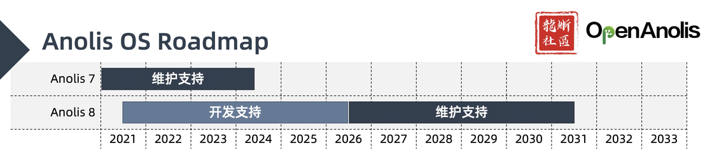
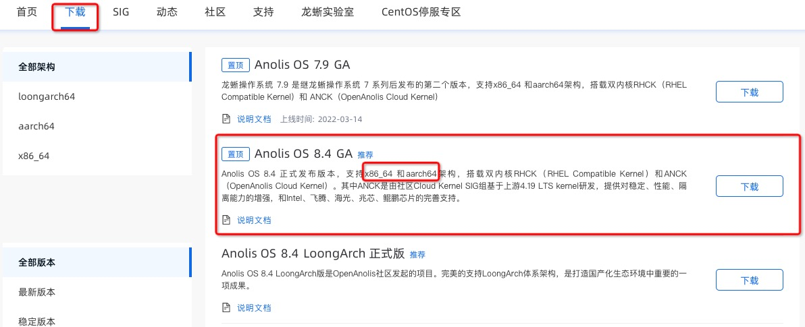

# 103 - 下载、安装和使用龙蜥操作系统

# 0. 了解龙蜥操作系统和版本

龙蜥操作系统 (Anolis OS) 是 OpenAnolis 龙蜥社区发行的开源 Linux 发行版，兼容主流 Linux 发行版操作习惯，支持多计算架构，提供稳定、高性能、安全、可靠的操作系统服务。当前 Anolis OS 提供 Anolis OS 7 和 Anolis OS 8 两个主要版本。Anolis OS 7 和 Anolis OS 8 均同时提供两个版本的内核，分别为 RHCK（RHEL Compatible Kernel，RHEL 兼容内核）和 ANCK（Anolis Cloud Kernel，Anolis 云内核）。其中ANCK 是由社区 Cloud Kernel SIG 组基于上游 4.19/5.10 LTS Kernel 研发，提供对稳定性，性能，隔离能力的增强，和龙芯、飞腾、海光、兆芯、鲲鹏芯片的完善支持。

想要了解更多关于 Anolis OS 的产品信息和版本计划，可以访问下列参考链接：
+ [官网产品页](https://openanolis.cn/anolisos)
+ [Anolis OS 产品生命周期](https://www.yuque.com/anolis-docs/product-policy/life-cycle)

# 1. 下载 Anolis OS 8

当前推荐的 Anolis OS 的版本为 Anolis OS 8，最新发布的小版本号为 8.4。可以通过官网的[下载](https://openanolis.cn/download)页面下载。下载时请注意选择正确架构。

# 2. 安装 Anolis OS 8

Anolis OS 产品文档中包含了 [Anolis OS 8 安装指南](https://www.yuque.com/anolis-docs/manual/installation)，根据该文档可以完成基于物理机或者虚拟机的安装。

# 3. 使用 Anolis OS 8

Anolis OS 8 的使用习惯兼容大多数 RPM 系的操作系统，例如 RHEL, CentOS, Fedora 等。网上基于这类操作系统的实践文档，很大程度上也可以在 Anolis OS 8 上通用。除此之外，[Anolis OS 产品语雀文档](https://www.yuque.com/anolis-docs)中包含了更多产品使用的说明文档，例如《[Anolis OS 8 操作系统桌面使用手册](https://www.yuque.com/anolis-docs/manual/desktop-manual)》。可以通过 [FAQ](https://www.yuque.com/anolis-docs/faq) 了解关于 Anolis OS 的常见问题，在日常使用中碰到问题也可以尝试在[知识库](https://www.yuque.com/anolis-docs/kbase)中寻找答案。

**注**: 如果对 Anolis OS 8 的产品文档有任何建议或意见，可以随时在对应的语雀文档下方评论中留言，也可以在本文档项目的 [Gitee issues](https://gitee.com/anolis/docs/issues) 页面提交需求或反馈问题。

# 4. 寻求帮助

在使用 Anolis OS 8 的过程中如果需要帮助，欢迎加入官方钉钉群：`33311793` 交流，也可以参考我们上一篇文章《[102 - 社区讨论途径](/docs/102-join-discussion.md)》找到更多在社区交流沟通的途径。
