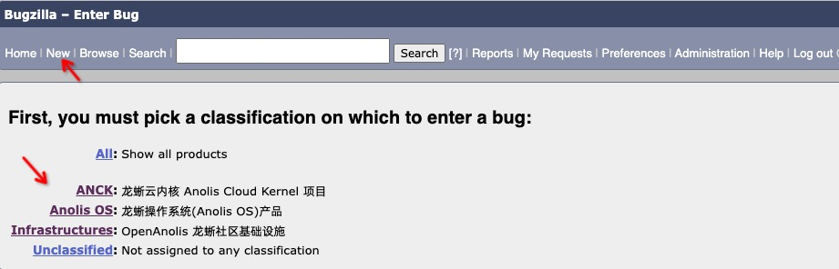
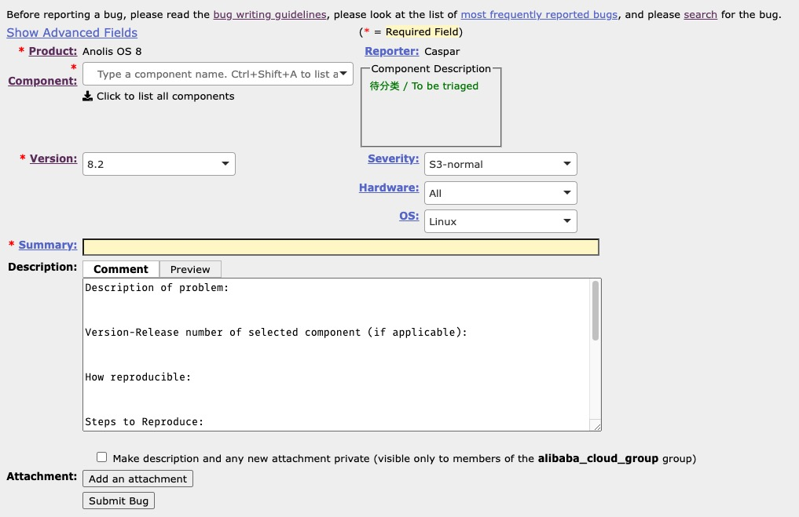

# 105 - 报告问题

## 1. 报告问题的途径

无论是龙蜥社区还是龙蜥操作系统，都有不完美的地方。作为社区参与者、开发者以及用户，在发现问题的时候反馈给社区，是一件非常有益的事情。反馈问题的途径也有很多种，参考《[102 - 社区讨论途径](/docs/102-join-discussion.md)》页面所说，可以在任何沟通过程中反馈问题。然而，对于问题和产品本身负责的态度，我们希望尽可能使用专用的问题反馈渠道。对于 Anolis OS 来说，[OpenAnolis Bugzilla 系统](https://bugzilla.openanolis.cn)就是一个很好的途径，而对于很多龙蜥的原创项目来说，在各自的 Gitee 代码仓库中，使用 Issue 来上报并管理相关缺陷，也是一个不错的选择。

当前龙蜥社区使用 Bugzilla 系统来管理的项目，可以通过[这个链接](https://bugzilla.openanolis.cn/describecomponents.cgi)查看。简单来讲，和Anolis OS 发行版、LifseaOS(Container OS) 发行版和ANCK 内核项目有关的问题，会优先推荐从 Bugzilla 系统提交。各个 SIG 组和独立项目，会定义自己的问题管理方式。例如 [轻豚 Keentune](https://gitee.com/anolis/keentuned) 项目，就使用 [Gitee Issues](https://gitee.com/anolis/keentuned/issues) 来管理各种缺陷。

下面将以 Bugzilla 为例，说明报告问题的通用方法。

## 2. 报告普通问题的方法

在使用社区账号登录 Bugzilla 后，点击界面上方的 `New` 链接，选择合适的产品和版本，进入 BUG 报告页面。

**注**: 如果确信自己报的问题和安全漏洞无关，则按普通问题处理；如果无法确定，则可以优先考虑按安全漏洞方式上报。

一个常见的 BUG 报告页面如下图所示：

有几项内容需要关注一下：
+ `Component`: 如果选择的产品是 Anolis OS 8，那么大概有下列组件(Component)可选：
  + `To Be Triaged`: **没有确定分类**的 BUG 可以选择这个;
  + `BaseOS Modules`: Anolis OS 8 引入的 Module stream 特性，此类软件更新会以 Module stream 为最小集合更新，**一般报 BUG 不会涉及**；
  + `BaseOS Packages`: **常规的软件包**相关的问题，如果你已经明确了自己的问题所述的软件包，你可以选择这个分类，并且在子组件(Sub-Component)字段里选择对应的软件包。**有部分软件包由于包名符合一定规则，因此以分类代替，而非直接展示单个软件包名**，下面[2.1小节](#21-子组件里用分类代替单个软件包的表格)的表格列出了匹配此情况的软件包列表；
  + `Desktop`: 如果问题现象和**桌面环境**有关系，可以选择这个；
  + `Images&Installations`: 如果问题现象和**操作系统镜像或者安装过程**有关，可以选择这个；
  + `kernel - rhck/anck-4.19/anck-5.10`: 如果问题现象和**特定版本内核**有关，可以选择这个；
  + `OsMigration`: 如果问题现象和**迁移工具**有关，可以选择这个。
+ `Version/Hardware/Severity`: 尽量填写准确；
+ `Summary`: 一句话概括，不要太长，力求简洁准确。
+ `Description`: 详细描述此次遇到的问题，在下文 2.2 节着重介绍。

### 2.1 子组件里用分类代替单个软件包的表格

| Bugzilla Sub-Component 字段 | 符合该字段的软件包格式 | 备注         |
|-----------------------------|------------------------|--------------|
| epel packages               | -                      | 有一些软件包是来自 EPEL 仓库的，当前龙蜥虽然不维护这些软件包，但是遇到 epel 软件包的时候可以选择这个分类 |
| aspell lang packages        | `aspell-XX`              | aspell 多国语言包 |
| fonts packages              | 通常以 `-fonts` 结尾     | 各类字体包   |
| hunspell lang packages      | `hunspell-XX`            | hunspell 多国语言包
| hyphen lang packages        | `hyphen-XX`              | hyphen 多国语言包  |
| mingw packages              | `mingw-XXX`              | mingw 插件包 |
| mythes lang packages        | `mythes-XX`              | mythes 多国语言包 |
| perl library packages       | 除 `perl-srpm-macros` 以外符合 `perl-XXX` 或 `perl-XXX-YYY` | perl 库 |
| python library packages     | 除 `python-{setuptools,pip,rpm-macros}` 以外符合 `python-XXX` | python 库 |
| ruby gem packages           | `rubygem-XXX`            | ruby gem 库|

### 2.2 报告问题的时候问题描述应该怎么写

在报告问题的时候，需要遵循下列几项基本原则：
+ 要尽量还原最原始的问题描述，不要只贴自己加工过的“二手信息”；
+ 尽量给出详细的复现步骤，以及问题的现场信息；
+ 尽量多给出环境信息，包括操作系统镜像名称、系统版本、内核版本、发生问题的软件包版本，以及 YUM 源信息等。

## 3. 报告安全漏洞的方法

龙蜥社区有专门的[安全委员会](https://openanolis.cn/sig/security-committee)接收并处理安全相关的软件漏洞。对于涉及安全相关的问题上报，请严格遵循社区安全委员会的《[安全漏洞报告和披露流程](https://openanolis.cn/sig/security-committee/doc/435846799673394804)》。
